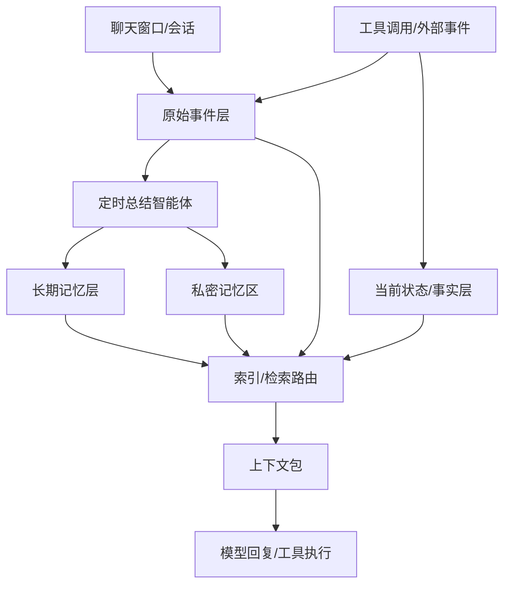

# 灵月记忆系统整体架构设计

更新时间: 2026-04-27  
定位: 本地优先的 AI 伴侣记忆系统总纲。本文只定义整体架构、数据分层、召回策略和扩展原则；各模块的具体 prompt、字段、工具流程后续单独设计。

## 1. 设计目标

灵月的记忆系统不是单纯知识库，也不是只服务 AI 伴侣聊天的用户画像。它需要支撑日常陪伴、工作协作、私密互动，以及后续逐步接入的工具能力，例如日程、闹钟、桌面组件、搜索、健身记录、智能家居等。

第一版不要求所有工具都已经存在，但底层架构必须支持未来扩展。

核心目标:

- 本地存储: 对话记录、长期记忆、私密记忆和索引默认保存在本地。
- 对话优先: 用户与 AI 的对话是最主要的原始资料来源。
- 低延迟: 普通聊天不能因为记忆检索和工具指令变慢。
- 场景隔离: 日常、工作、工具、私密模式不能互相污染。
- 可扩展: 当前没有日程、闹钟、智能家居时可以先空置，后续以模块方式接入。
- 可控: 模型可以参与理解和总结，但存储、权限、路由和私密隔离必须由系统控制。

## 2. 核心架构

灵月记忆系统采用三层数据 + 一个路由层:

```text
原始事件层 Event Log
  -> 当前状态/事实层 Materialized State
  -> 定时总结智能体 Memory Consolidation
  -> 长期记忆层 Long-term Memory

对话时:
当前场景 -> 索引/检索路由 -> 选择数据层 -> 打包上下文 -> 交给模型
```



## 3. 数据分层

### 3.1 原始事件层

原始事件层保存“发生过什么”。每次用户打开新聊天窗口，就是一个新的 `conversation_id`，但所有会话都属于同一个本地记忆空间。

当前第一版最重要的数据就是对话记录:

- 用户消息
- AI 回复
- 会话时间
- 会话类型，例如日常、工作、私密、工具
- 未来工具调用和工具结果

原始事件层不等于长期记忆。它是后续总结、回溯、调试的原始资料。

### 3.2 当前状态/事实层

当前状态/事实层保存“现在是什么”。它不靠模型猜，也不靠向量匹配。

当前可以先只保存基础状态，例如当前会话、当前时间、当前任务。后续可扩展:

- 日程
- 闹钟
- 待办
- 天气
- 桌面组件状态
- 健身记录
- 智能家居设备状态
- 当前工具指令和执行状态

这一层的原则是准确、结构化、可过期。比如天气、股票、设备状态都是当前事实，不应该沉淀成长期记忆，除非用户反复表达出稳定偏好。

### 3.3 长期记忆层

长期记忆层保存从原始事件中提炼出的“未来有用的信息”。

它可以覆盖:

- 用户稳定偏好
- 重要关系和纪念日
- 情绪强度较高的生活事件
- 工作项目目标、决策和约束
- 用户对 AI 伴侣的互动偏好
- 工具使用习惯和自动化倾向

长期记忆不是实时逐句写入，而是由定时总结智能体提取。普通聊天时只召回少量高相关记忆，避免上下文变重。

### 3.4 私密记忆区

私密调情模式的记忆单独存放，单独召回，默认不进入普通聊天、工作和工具场景。

私密记忆不是“不记”，而是记忆方式和使用方式不同:

- 记录语气、称呼、边界、暗号、氛围偏好。
- 不在普通场景主动提起。
- 在私密场景中作为风格和边界提示使用。
- 支持手动切换、暗号触发，也可根据人设关系主动触发。

主动触发必须受人设和用户关系约束。更开放、亲密的人设可以更主动；保守人设应等待用户触发。

## 4. 定时总结策略

记忆提取由后台定时总结智能体完成。

已确认策略:

- 每天固定触发 2 次总结。
- 用户明确说“记住这个”时，可以立即写入。
- 工作会话结束后可以标记为待总结，但仍进入定时总结流程。
- 日常对话、工作对话、工具事件、私密模式使用不同总结策略。

总结智能体只提取未来可能有用的内容，不记录普通闲聊、临时操作和大量中间过程。

尤其在工作/编程场景中，大量设计讨论和代码尝试不一定都值得长期记住。真正重要的是:

- 项目目标
- 关键设计决策
- 用户明确的偏好或约束
- 未解决问题
- 阶段性进展
- 明显挫折、压力、兴奋或成就感

## 5. 召回与索引路由

召回策略是体验核心。系统不能每句话都全库搜索，也不能只依赖向量匹配。

索引/检索路由层负责:

- 判断当前场景。
- 决定允许访问哪些数据层。
- 决定使用哪种检索方式。
- 屏蔽不该进入当前场景的记忆。
- 控制上下文长度。

推荐调用顺序:

```text
用户输入
  -> 轻量场景判断
  -> 选择允许访问的数据层和记忆范围
  -> 选择检索方式
  -> 检索候选内容
  -> 过滤禁止内容
  -> 去重、排序、控制长度
  -> 生成上下文包
  -> 交给模型
```

不同信息使用不同方式:

| 信息类型 | 优先方式 |
| --- | --- |
| 当前时间、天气、闹钟、日程、设备状态 | 精确查询 / TTL |
| 当前工具指令 | 规则 + 小模型分类 |
| 工作项目内容 | project_id + 关键词 + 项目摘要 |
| 明确的人名、项目名、地点 | 关键词 / 全文索引 |
| 模糊语义问题 | 向量 + 关键词混合 |
| 情绪和关系记忆 | 场景过滤 + 重要度 + 时间 |
| 私密记忆 | 私密场景 + 独立索引 |

这个路由可以由规则引擎加一个小 router agent 完成。它不负责深度思考，只负责“查哪里、怎么查、哪些不能查”。

## 6. 场景隔离

灵月至少需要区分以下场景:

| 场景 | 默认使用 | 默认屏蔽 |
| --- | --- | --- |
| 日常陪伴 | 近期摘要、少量伴侣记忆、普通偏好 | 私密记忆、过重工作上下文 |
| 情绪支持 | 安慰偏好、近期高强度情绪事件 | 工具日志、无关工作细节 |
| 工作项目 | 当前项目摘要、工作偏好、关键决策 | 私密记忆、无关生活闲聊 |
| 工具指令 | 当前状态/事实、相关工具规则 | 情感事件、私密记忆 |
| 私密模式 | 私密记忆、私密边界、语气偏好 | 工作记忆、工具日志 |

工作项目需要独立会话空间和 `project_id`。日常对话和工作内容分开处理，默认不互相召回。

## 7. 工具扩展原则

当前阶段可以没有完整的日程、闹钟、智能家居等工具，但架构要支持后续接入。

每个工具模块接入时，只需要遵守三条规则:

1. 工具调用和结果写入原始事件层。
2. 当前有效状态写入当前状态/事实层。
3. 只有稳定偏好、重复模式、异常事件或用户明确要求，才进入长期记忆层。

未来可接入模块:

- 日程/闹钟/提醒
- 搜索与资料整理
- 桌面组件
- 健身和健康记录
- 股票/新闻/天气
- 摄像头与监控摘要
- 米家/智能家居

工具越多，越需要工具路由。系统应先判断工具域，只加载相关工具能力，不把所有工具说明塞进每轮对话。

## 8. 模型能力边界

可以使用模型能力的部分:

- 判断当前场景。
- 从对话中提取候选记忆。
- 总结日常、工作、工具、私密模式的内容。
- 判断候选记忆的重要度、置信度和敏感度。
- 对检索结果排序。
- 把记忆自然融入回复。

必须由系统控制的部分:

- 原始记录保存。
- 当前状态准确性。
- 私密记忆隔离。
- 当前场景能访问哪些记忆。
- 工具权限和高风险操作确认。
- 记忆删除、修改、备份。
- 本地加密和数据边界。

简言之: 模型负责理解和表达，系统负责存储、权限、路由和安全。

## 9. 本地实现建议

第一版建议保持简单:

- SQLite: 保存原始事件、当前状态/事实、长期记忆。
- 私密记忆: 单独加密表或单独加密库。
- 全文索引: 支持关键词检索。
- 向量索引: 支持模糊语义检索。
- 本地 worker: 每天 2 次执行总结。

关于 embedding:

- embedding 是把文本转成向量，用于语义相似检索。
- 记忆存储必须本地。
- embedding 长期建议本地生成。
- 总结模型第一版可以云端可选，后续再支持本地模型。

用户不需要看到每条记忆的来源追踪。系统内部可以保留最小来源 ID，用于删除、调试和审计。

## 10. 已确认决策

| 问题 | 决策 |
| --- | --- |
| 定时总结 | 每天 2 次；用户明确要求记住时立即写入 |
| 私密模式 | 手动切换和暗号触发都支持；可按人设关系主动触发 |
| 工作项目 | 使用独立会话和 `project_id`，与日常对话分开 |
| 工具接入 | 当前可为空，架构支持后续模块化接入 |
| 本地模型 | 存储必须本地；embedding 尽量本地；总结模型可逐步本地化 |
| 来源追踪 | 用户界面不展示，系统内部保留最小来源 ID |
| 检索方式 | 不只用向量匹配，按场景组合精确查询、关键词、向量、时间和 scope 过滤 |
