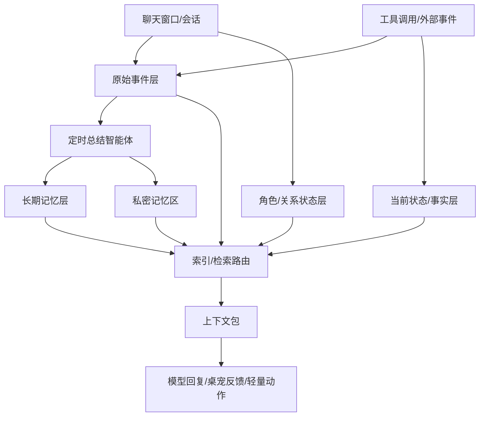

# 灵月 AI 伴侣记忆系统整体架构设计

更新时间: 2026-05-26
定位: 本地优先的桌面 AI 伴侣记忆系统总纲。灵月的核心不是编程级 Agent，而是一个有形象、有温度、能陪伴、能通过轻量动作帮用户整理桌面生活的 AI 伴侣。

本文定义记忆、状态、召回和轻量工具扩展原则；复杂文件工作流、回滚、审批、编程 Agent 能力只作为高级辅助能力参考，不作为当前产品主线。

## 1. 设计目标

灵月的记忆系统不是知识库，也不是 Codex 式项目 Agent。它首先服务“我正在和一个熟悉我的桌面伙伴说话”这种体验：她知道自己的形象和性格，记得用户稳定偏好，能感知用户当下状态，能把天气、新闻、桌面组件、桌宠动作、轻量电脑操作自然融进对话。

第一版不追求完整工具平台，底层只需要支持后续逐步扩展。工具越复杂，越应隐藏在“顺手帮你做一下”的体验背后，而不是把用户带进严肃的任务审查流程。

核心目标:

- 陪伴优先: 用户与 AI 的自然对话、情绪反馈和关系感是第一优先级。
- 形象一致: 人设、语气、桌宠动作、等待状态和 UI 反馈要像同一个角色。
- 本地存储: 对话记录、长期记忆、私密记忆和组件状态默认保存在本地。
- 轻量低延迟: 普通聊天不能因为记忆检索、工具说明或复杂任务系统变慢。
- 场景隔离: 日常陪伴、情绪支持、组件/桌面助手、私密互动、轻工作协助默认分开召回。
- 轻工具: 电脑操作是辅助能力，优先覆盖打开、搜索、复制、截图、便签、天气、新闻、简单文件生成和组件控制。
- 可控边界: 模型负责理解和表达，系统负责记忆边界、隐私隔离、组件状态和真实动作执行。
- 运行时可修: 打包后应用本体和内置资源只读，AI 自检/自修复只面向 userData 中的配置、导入资源、组件覆盖和未来受控扩展包。

## 2. 核心架构

灵月记忆系统采用四层数据 + 一个路由层:

```text
原始事件层 Event Log
  -> 当前状态/事实层 Materialized State
  -> 角色/关系状态层 Companion State
  -> 定时总结智能体 Memory Consolidation
  -> 长期记忆层 Long-term Memory

对话时:
当前场景 -> 召回/状态路由 -> 选择少量相关数据 -> 打包上下文 -> 生成伴侣式回复或轻量动作
```



## 3. 数据分层

### 3.1 原始事件层

原始事件层保存“发生过什么”。每次用户打开新聊天窗口，就是一个新的 `conversation_id`，但所有会话都属于同一个本地记忆空间。

当前第一版最重要的数据就是对话记录:

- 用户消息
- AI 回复
- 会话时间
- 会话类型，例如日常陪伴、情绪支持、桌面助手、轻工作、私密
- 轻量工具调用、组件变化和工具结果

原始事件层不等于长期记忆。它是后续总结、回溯、调试的原始资料。

### 3.2 当前状态/事实层

当前状态/事实层保存“现在是什么”。它不靠模型猜，也不靠向量匹配。

当前可以先保存基础状态，例如当前会话、当前时间、当前话题、最近工具动作、当前桌宠表情/动作。后续可扩展:

- 日程
- 闹钟
- 待办
- 天气
- 桌面组件状态
- 当前壁纸和桌面氛围
- 桌宠动作、心情和互动状态
- 健身记录
- 智能家居设备状态
- 当前工具指令和执行状态

这一层的原则是准确、结构化、可过期。比如天气、股票、设备状态都是当前事实，不应该沉淀成长期记忆，除非用户反复表达出稳定偏好。

### 3.3 角色/关系状态层

角色/关系状态层保存“灵月现在以什么样的状态陪在用户身边”。它不是长期记忆，而是影响本轮回复和 UI 表现的短中期状态。

它可以覆盖:

- 当前人设名称、角色设定、称呼习惯。
- 当前对话情绪，例如轻松、认真、安慰、调皮、专注。
- 桌宠动作状态，例如 idle、thinking、searching、happy、concerned。
- 最近一次用户情绪和压力信号。
- 用户当前正在做的事情，例如写文档、整理桌面、看新闻、休息。
- 当前组件状态，例如刚生成的便签、天气卡片、倒计时、计划清单。

这一层的目标是让 AI 反馈像“同一个角色在连续陪伴”，而不是每轮都像新的问答机器人。

### 3.4 长期记忆层

长期记忆层保存从原始事件中提炼出的“未来有用的信息”。

它可以覆盖:

- 用户稳定偏好
- 重要关系和纪念日
- 情绪强度较高的生活事件
- 轻工作目标、长期计划和用户明确的创作偏好
- 用户对 AI 伴侣的互动偏好
- 桌面组件使用习惯和常用轻工具偏好

长期记忆不是实时逐句写入，而是由定时总结智能体提取。普通聊天时只召回少量高相关记忆，避免上下文变重。

### 3.5 私密记忆区

私密调情模式的记忆单独存放，单独召回，默认不进入普通聊天、工作和工具场景。

私密记忆不是“不记”，而是记忆方式和使用方式不同:

- 记录语气、称呼、边界、暗号、氛围偏好。
- 不在普通场景主动提起。
- 在私密场景中作为风格和边界提示使用。
- 支持手动切换、暗号触发，也可根据人设关系主动触发。

主动触发必须受人设和用户关系约束。更开放、亲密的人设可以更主动；保守人设应等待用户触发。

## 4. 定时总结策略

记忆提取由后台定时总结智能体完成。

已确认策略:

- 每天固定触发 2 次总结。
- 用户明确说“记住这个”时，可以立即写入。
- 轻工作/创作对话可以标记为待总结，但仍进入定时总结流程。
- 日常陪伴、情绪支持、组件/桌面助手、轻工作、私密模式使用不同总结策略。

总结智能体只提取未来可能有用的内容，不记录普通闲聊、临时操作和大量中间过程。

尤其在轻工作/创作场景中，大量中间尝试不一定都值得长期记住。真正重要的是:

- 项目目标
- 关键设计决策
- 用户明确的偏好或约束
- 未解决问题
- 阶段性进展
- 明显挫折、压力、兴奋或成就感

## 5. 召回与索引路由

召回策略是体验核心。系统不能每句话都全库搜索，也不能只依赖向量匹配。

索引/检索路由层负责:

- 判断当前场景。
- 决定允许访问哪些数据层。
- 决定使用哪种检索方式。
- 屏蔽不该进入当前场景的记忆。
- 控制上下文长度。

推荐调用顺序:

```text
用户输入
  -> 轻量场景判断
  -> 选择允许访问的数据层和记忆范围
  -> 选择检索方式
  -> 检索候选内容
  -> 过滤禁止内容
  -> 去重、排序、控制长度
  -> 生成上下文包
  -> 交给模型
```

不同信息使用不同方式:

| 信息类型 | 优先方式 |
| --- | --- |
| 当前时间、天气、闹钟、日程、设备状态 | 精确查询 / TTL |
| 当前工具指令 | 规则 + 小模型分类 |
| 桌面组件状态 | 组件 ID + 类型 + 当前配置 |
| 轻工作/创作内容 | project_id + 关键词 + 简短摘要 |
| 明确的人名、项目名、地点 | 关键词 / 全文索引 |
| 模糊语义问题 | 向量 + 关键词混合 |
| 情绪和关系记忆 | 场景过滤 + 重要度 + 时间 |
| 私密记忆 | 私密场景 + 独立索引 |

这个路由可以由规则引擎加一个小 router agent 完成。它不负责深度思考，只负责“查哪里、怎么查、哪些不能查”。

## 6. 场景隔离

灵月至少需要区分以下场景:

| 场景 | 默认使用 | 默认屏蔽 |
| --- | --- | --- |
| 日常陪伴 | 人设、关系状态、少量普通偏好、近期话题 | 私密记忆、过重工具日志 |
| 情绪支持 | 安慰偏好、近期高强度情绪事件、称呼和边界 | 无关工具细节、过重工作上下文 |
| 组件/桌面助手 | 当前组件状态、桌面环境、轻工具结果 | 私密记忆、无关情绪历史 |
| 轻工作/创作 | 当前项目摘要、创作偏好、关键决策 | 私密记忆、无关生活闲聊 |
| 私密模式 | 私密记忆、私密边界、语气偏好 | 工作记忆、工具日志 |

轻工作项目可以使用独立会话和 `project_id`，但不是产品主线。日常陪伴和组件/桌面助手可以自然切换，只要不泄露私密内容或塞入过重上下文。

## 7. 轻量工具与组件扩展原则

当前阶段不做完整编程 Agent。工具系统优先支持“伴侣顺手帮忙”的动作，重点是让用户感到自然、轻松、可理解。

每个工具模块接入时，只需要遵守三条规则:

1. 工具调用和结果写入原始事件层。
2. 当前有效状态写入当前状态/事实层。
3. 只有稳定偏好、重复模式、异常事件或用户明确要求，才进入长期记忆层。

优先接入模块:

- 桌面组件
- 桌宠动作和表情
- 日程/闹钟/提醒
- 搜索、新闻、天气和位置
- 便签、截图、剪贴板
- 打开应用/网页/文件夹
- 简单文件生成，例如便签、清单、Markdown、CSV

后续可接入模块:

- 健身和健康记录
- 摄像头与监控摘要
- 米家/智能家居

工具越多，越需要轻量路由。系统应先判断工具域，只加载相关能力，不把所有工具说明塞进每轮对话。工具过程默认以角色化短句反馈，例如“我给你顺手记一下”“我看眼天气”“我把这个放到桌面上”，而不是展示复杂 Agent 日志。

### 7.1 运行时可修复边界

打包发布后，内置程序和资源应被视为只读。AI 伴侣可以“检查并尝试修好”的对象，只限于运行时可变数据和受控扩展层。

可修复范围:

- `electron-store` 中的人设、模型、壁纸、组件状态。
- SQLite 中的对话、记忆、轻量动作和工具事件。
- `userData/wallpapers/<id>/` 用户导入壁纸。
- `userData/wallpaper-overrides/<wallpaperId>/settings.json` 壁纸设置覆盖。
- `userData/wallpaper-overrides/<wallpaperId>/widget-config.json` 组件覆盖配置。
- 未来 `userData/components/` 下由对话生成的组件包。

不可直接修复范围:

- 主进程、preload、渲染层核心代码。
- IPC 桥、工具注册表、模型适配器和权限边界。
- asar、`resources/assets`、构建配置、原生依赖和签名。

当问题落在不可修复范围时，产品反馈应是“我检查到了原因，但这里需要应用更新”，而不是假装已经自动修好。这样既保留 AI 伴侣的主动感，也避免打包后自改程序带来的不稳定和安全风险。

## 8. 模型能力边界

可以使用模型能力的部分:

- 判断当前场景。
- 从对话中提取候选记忆。
- 总结日常、工作、工具、私密模式的内容。
- 判断候选记忆的重要度、置信度和敏感度。
- 对检索结果排序。
- 把记忆自然融入回复。
- 生成符合人设的语气、停顿、情绪回应和轻量动作说明。
- 根据对话意图提出或生成桌面组件草案。

必须由系统控制的部分:

- 原始记录保存。
- 当前状态准确性。
- 私密记忆隔离。
- 当前场景能访问哪些记忆。
- 真实工具动作执行。
- 组件状态写入和桌面配置边界。
- 高风险操作确认。
- 记忆删除、修改、备份。
- 本地加密和数据边界。

简言之: 模型负责理解、表达和陪伴感；系统负责存储、状态、动作边界和隐私。

## 9. 本地实现建议

第一版建议保持简单:

- SQLite: 保存原始事件、当前状态/事实、长期记忆。
- 私密记忆: 单独加密表或单独加密库。
- 全文索引: 支持关键词检索。
- 向量索引: 支持模糊语义检索。
- 本地 worker: 每天 2 次执行总结。
- 组件状态: 每个组件保留类型、配置、位置、来源对话和最后一次 AI 修改时间。
- 轻量动作日志: 只保留用户可理解的摘要，复杂工具原始日志默认隐藏。

关于 embedding:

- embedding 是把文本转成向量，用于语义相似检索。
- 记忆存储必须本地。
- embedding 长期建议本地生成。
- 总结模型第一版可以云端可选，后续再支持本地模型。

用户不需要看到每条记忆的来源追踪。系统内部可以保留最小来源 ID，用于删除、调试和审计。

## 10. 已确认决策

| 问题 | 决策 |
| --- | --- |
| 定时总结 | 每天 2 次；用户明确要求记住时立即写入 |
| 私密模式 | 手动切换和暗号触发都支持；可按人设关系主动触发 |
| 轻工作项目 | 可使用独立会话和 `project_id`，但不作为主线 |
| 工具接入 | 以轻量桌面助手和组件控制为主，复杂本地 Agent 降级为高级辅助 |
| 组件联动 | 对话可生成、调整或解释桌面组件，组件状态进入当前状态层 |
| 本地模型 | 存储必须本地；embedding 尽量本地；总结模型可逐步本地化 |
| 来源追踪 | 用户界面不展示，系统内部保留最小来源 ID |
| 检索方式 | 不只用向量匹配，按场景组合精确查询、关键词、向量、时间和 scope 过滤 |
