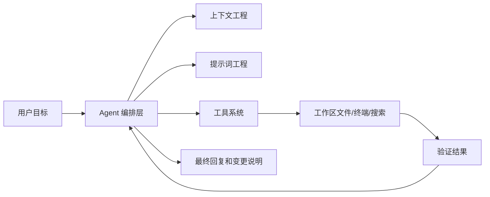
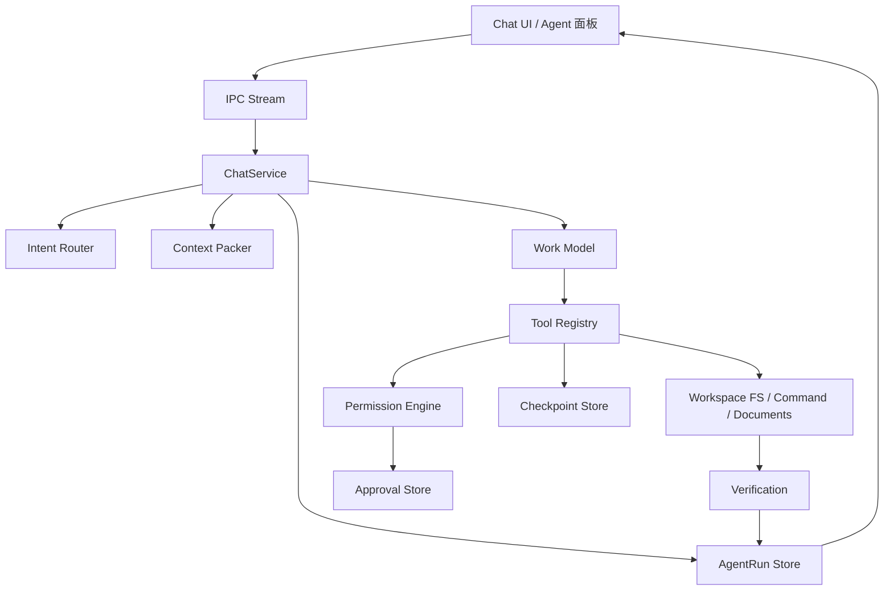
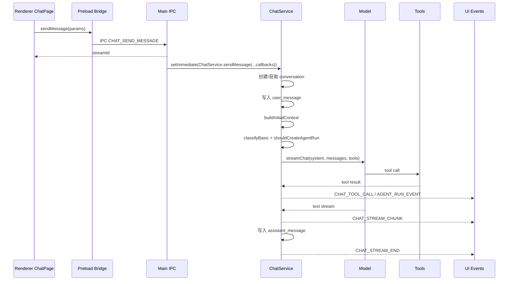
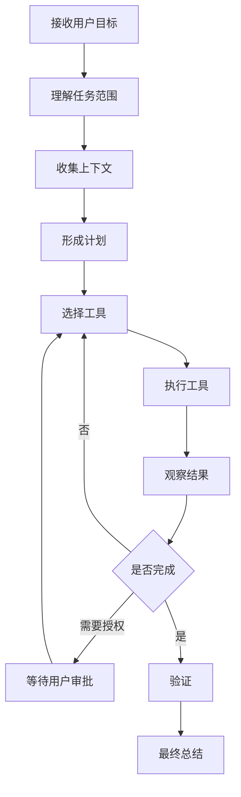
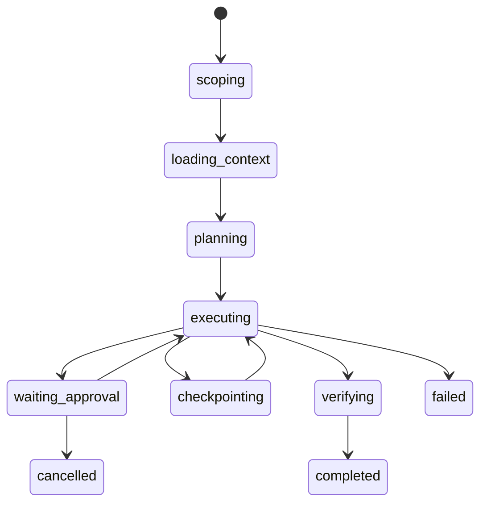
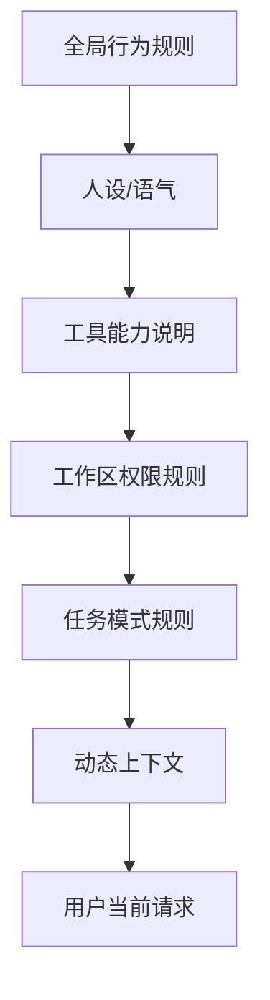
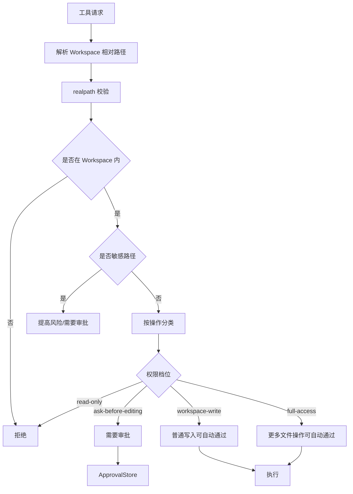
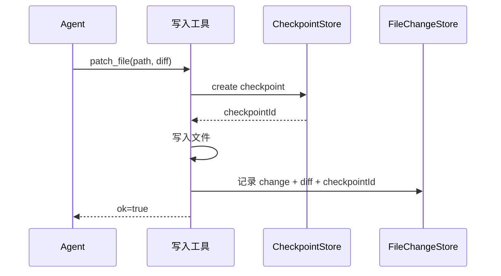
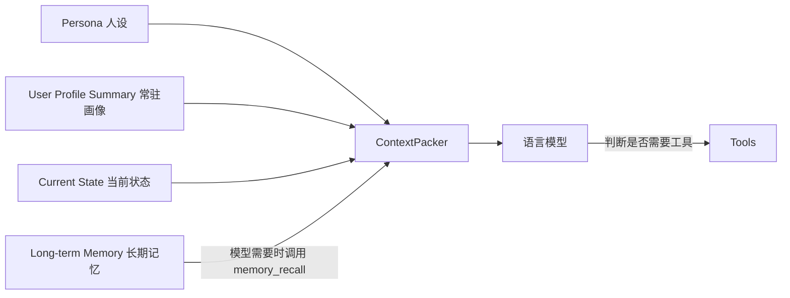
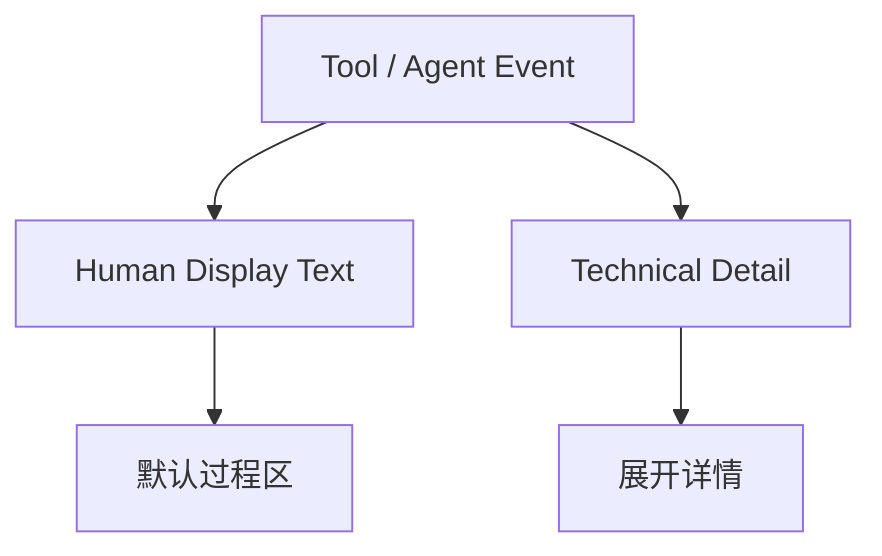

# VS Code 智能体设计文档

> 最后更新：2026-05-17
> 读者：产品设计、Agent 架构、提示词工程、前后端实现和后续接手开发者
> 本文用于整理 VS Code / Copilot Agent 类工作区智能体的整体设计，并映射到灵月桌面现有本地工作区 Agent。它不替代 `AI对话与智能体设计说明.md`，而是单独聚焦“像 VS Code 一样在项目里工作的 Agent”。

## 0. 一句话定位

VS Code Agent 的本质不是“更聪明的聊天框”，而是一个在编辑器里运行的受控软件工程执行系统。

它把用户的一句话拆成：理解任务、收集上下文、制定计划、调用工具、修改文件、运行验证、向用户汇报。模型负责推理和决策，系统负责边界、权限、记录、可见性和回滚。



---

## 1. VS Code Agent 的产品形态

### 1.1 普通 Chat 与 Agent 的区别

| 维度 | 普通 Chat | VS Code Agent |
| --- | --- | --- |
| 输入 | 用户问题 | 用户目标 + 当前工作区状态 |
| 输出 | 文本答案 | 文本答案 + 文件变更 + 命令结果 + 产物 |
| 上下文 | 对话历史为主 | 对话历史、打开文件、搜索结果、诊断、终端、git diff、项目结构 |
| 控制方式 | 模型直接回答 | 模型循环调用工具，系统控制权限和流程 |
| 风险 | 答错 | 改错文件、运行错命令、破坏用户改动 |
| 必要能力 | 会说清楚 | 会查、会改、会验证、会解释、可撤回 |

### 1.2 用户心智

用户不需要理解模型内部怎么想，但需要看到三个事实：

| 用户关心 | Agent 必须回答 |
| --- | --- |
| 你准备怎么做？ | 计划和当前步骤 |
| 你看了什么？ | 上下文文件、搜索结果、命令输出摘要 |
| 你改了什么？ | 文件变更、diff、验证结果 |

推荐体验结构：

```text
用户：帮我修一下这个报错。

Agent：我先看报错来源和相关调用链。

过程：读取文件 / 搜索符号 / 查看诊断

Agent：问题在 xxx，准备改 a.ts 和 b.ts。

过程：应用补丁 / 运行 typecheck

Agent：已修复，改了两个文件，typecheck 通过。
```

### 1.3 灵月中的定位

灵月桌面当前已经有两条 AI 链路：

| 链路 | 适用场景 | 对应文件 |
| --- | --- | --- |
| 轻量聊天工具 | 天气、新闻、时间、记忆、搜索、剪贴板 | `src/main/memory/chat/chatService.ts` |
| 本地工作区 Agent | 读写项目文件、生成产物、运行命令、审批、Checkpoint | `src/main/memory/agent/`、`src/main/memory/tools/` |

本文重点讨论第二条：本地工作区 Agent。但当前实现里，轻量聊天工具和工作区 Agent 已经收束到同一套 `ChatService + Tool Calling + AgentRun` 过程：普通天气、新闻、记忆、计算也可以产生工具事件；涉及工作区、文件、命令、审批和产物时，会进一步形成可追踪的 AgentRun。

---

## 2. 总体架构

### 2.1 分层架构



### 2.2 核心模块职责

| 模块 | 职责 | 灵月现有实现 |
| --- | --- | --- |
| Chat UI | 发起请求、展示流式回复、过程、审批和任务记录 | `src/renderer/main-ui/pages/chat/ChatPage.tsx` |
| IPC Stream | 返回 streamId，转发 token、工具事件、AgentRun 事件 | `src/main/ipc/chatIpc.ts` |
| ChatService | 总编排：路由、上下文、模型调用、工具回调、落库 | `src/main/memory/chat/chatService.ts` |
| Model Adapter | 适配 OpenAI 兼容、Google Gemini 和 DeepSeek 工具循环 | `src/main/memory/models/chatModel.ts`、`src/main/memory/models/deepseekToolChat.ts` |
| Context Packer | 拼装人设、工具说明、最近用户/助手消息、记忆、状态 | `src/main/memory/routing/contextPacker.ts` |
| Intent Router | 当前为规则场景识别和关键词 AgentRun 判断；JSON Router 是后续目标 | `classifyBasic()`、`shouldCreateAgentRun()` |
| AgentRun | 保存计划、状态、工具、审批、文件变更、产物、验证 | `src/main/memory/agent/agentRunStore.ts` |
| Tool Registry | 注册所有可调用工具，交给 AI SDK tool calling | `src/main/memory/tools/registry.ts` |
| Permission Engine | 路径、权限、敏感文件、自动审批策略 | `src/main/memory/security/permissionEngine.ts` |
| Checkpoint | 写入前快照，可对比和恢复 | `src/main/memory/agent/checkpointStore.ts` |
| Verification | 任务后检查文件、目录、文本和 Artifact | `src/main/memory/agent/verificationEngine.ts` |

### 2.3 消息调用链



### 2.4 当前实现快照

截至 2026-05-13，灵月智能体的实际链路如下：

| 事项 | 当前实现 |
| --- | --- |
| IPC 时序 | `CHAT_SEND_MESSAGE` 先返回 `streamId`，再异步启动 `ChatService.sendMessage`，避免早期 tool/AgentRun 事件被前端过滤。 |
| 路由 | 使用 `classifyBasic()` 做场景识别，使用 `shouldCreateAgentRun()` 通过关键词和工作区状态决定是否创建 AgentRun；尚未接入模型 JSON Router。 |
| 上下文 | `buildInitialContext()` 注入人设、工具能力、RetrievalRouter 记忆/状态，以及最近用户/助手消息；历史 `tool_call/tool_result` 目前只落库和展示，不会结构化 replay 给下一轮模型。 |
| 模型调用 | OpenAI 兼容和 Gemini 走 AI SDK `streamText()`；DeepSeek 有工具时走 `streamDeepSeekToolChat()`，手动保留并回传 `reasoning_content`，兼容 `deepseek-v4-pro` thinking tool calling。 |
| AgentRun | 可由用户意图预创建，也可在任意注册工具开始执行时动态创建；工具过程会写入 `tool_call/tool_result` 事件并同步 AgentRun 状态。 |
| 搜索工具 | `web_search` 已接入真实网页搜索：优先使用 `TAVILY_API_KEY`、`BRAVE_SEARCH_API_KEY`、`EXA_API_KEY`，无 Key 时使用 DuckDuckGo HTML + Bing HTML 兜底；DuckDuckGo Instant Answer 只作为摘要补充，不再作为主搜索结果来源。 |
| 位置工具 | `get_user_location` 已接入位置获取：默认只使用 IP 城市级粗略位置；用户在通用设置中开启“精准定位授权”时必须实际获取设备坐标成功，开关才会保持开启；开启后位置工具会优先请求设备/系统 Geolocation，高精度不可用时设置页提供打开 Windows 定位设置入口；`weather` 未指定城市时会直接使用可用坐标查询，不再反复询问用户城市。 |
| 权限 | 工作区路径、敏感文件、写入、删除和命令由 Permission Engine 与 ApprovalStore 控制；`workspace-write/full-access` 可自动通过部分普通写入。 |
| 验证 | `verify_workspace_result` 当前偏文件、目录、文本和 Artifact 检查；typecheck/build/test 等命令级验证需要通过 `run_command` 执行。 |

---

## 3. Agent 运行循环

### 3.1 标准循环

VS Code Agent 不是一次模型调用就结束，而是一个受限循环：



在灵月里，这个循环主要由 Vercel AI SDK v6 的 `streamText()` + `tools` + `stopWhen: stepCountIs(maxSteps)` 承担，当前默认 `maxSteps = 8`。DeepSeek 工具调用是例外：由于 `deepseek-v4-pro` 这类 thinking 模型要求第二轮请求回传上一条 assistant 消息里的 `reasoning_content`，当前通过 `streamDeepSeekToolChat()` 手动维护 OpenAI-compatible `/chat/completions` 工具循环。

### 3.2 AgentRun 状态机



灵月的状态定义在 `src/shared/types.ts`：

| 状态 | 含义 |
| --- | --- |
| `scoping` | 理解任务目标和影响范围 |
| `loading-context` | 准备项目、历史、记忆和文件上下文 |
| `planning` | 生成计划，判断工具和风险 |
| `executing` | 调用工具、读取或修改工作区 |
| `waiting-approval` | 等待用户确认高风险操作 |
| `checkpointing` | 修改前创建快照 |
| `verifying` | 检查结果是否满足任务 |
| `review-ready` | 变更可审阅 |
| `completed` | 完成 |
| `failed` | 失败 |
| `cancelled` | 用户停止 |

### 3.3 计划生成

计划不是让模型随便写一段 Markdown，而是结构化数据：

```ts
interface AgentPlanStep {
  id: string
  goal: string
  toolCategory: string
  readOnly: boolean
  writesFiles: boolean
  requiresApproval: boolean
  expectedFiles: string[]
  verification: string
  status: 'pending' | 'running' | 'completed' | 'blocked' | 'failed' | 'skipped'
}
```

灵月当前用 `createInitialAgentPlan()` 根据关键词和工作区权限生成初始计划。它的价值是让 UI 有稳定结构，避免直接解析模型自然语言。

当前计划还没有“模型读完上下文后再细化”的第二阶段；计划状态主要由 `AgentRunStatus` 推动，例如进入 `executing`、`checkpointing`、`waiting-approval` 或 `verifying` 时更新对应步骤。

推荐后续升级为两段式：

| 阶段 | 说明 |
| --- | --- |
| 系统初始计划 | 用规则快速生成，立即给用户反馈 |
| 模型细化计划 | 模型读完上下文后补充更准确的文件、风险和验证方式 |

---

## 4. 上下文工程

### 4.1 上下文不是越多越好

Agent 的效果取决于“拿到正确上下文”，不是把整个项目塞进模型。VS Code Agent 的上下文通常分为：

| 上下文 | 来源 | 作用 |
| --- | --- | --- |
| 会话上下文 | 最近消息、用户要求 | 保持多轮任务连续性 |
| 编辑器上下文 | 当前文件、选区、诊断、打开标签 | 判断用户正在处理什么 |
| 工作区上下文 | 文件树、搜索结果、相关源码 | 解决真实项目问题 |
| 运行上下文 | 终端输出、测试结果、构建错误 | 验证和调试 |
| 版本上下文 | git diff、未提交改动、变更历史 | 避免覆盖用户工作 |
| 用户偏好 | 记忆、人设、项目约定 | 调整语气和实现风格 |

灵月当前已具备会话历史、记忆/状态、工作区路径、文件工具和 AgentRun 记录；编辑器诊断、git diff、终端输出语义化还可以继续增强。

### 4.2 灵月当前 Context Packer

`buildInitialContext()` 当前拼装：

| 层 | 内容 |
| --- | --- |
| Persona | 当前用户选择的人设 prompt |
| Tool Capability | 工具能力说明和使用规则 |
| Retrieval | `RetrievalRouter.retrieve()` 注入相关记忆和当前状态 |
| Recent Events | 最近 30 条事件里只回放用户消息和助手消息 |
| Workspace Router | `buildToolRouterPrompt()` 注入工作区、权限和工具边界 |

输出是 `system` 和 `messages` 分离结构，适配 AI SDK `streamText({ system, messages })`。

注意：`tool_call` 和 `tool_result` 当前会持久化并用于 UI 展示，但不会被 `buildInitialContext()` 结构化放回下一轮模型输入。也就是说，同一轮工具循环可靠，跨轮对工具结果的记忆主要依赖助手最终回复和数据库记录，后续应补“历史工具结果摘要 replay”。

### 4.3 上下文打包原则

| 原则 | 说明 |
| --- | --- |
| 先结构化，后自然语言 | 文件列表、诊断、权限、计划都应结构化存储，再转 prompt |
| 先窄后宽 | 先搜索/读取候选文件，必要时扩大范围 |
| 给证据，不给噪声 | prompt 中放摘要、路径、关键片段，不塞无关长文件 |
| 让模型知道缺口 | 明确哪些文件未读、哪些命令未跑、哪些操作未获批 |
| 区分事实和建议 | 工具结果是事实，模型推测是建议，最终回复不能混淆 |

### 4.4 推荐的上下文包格式

后续可以把系统 prompt 中的上下文固定成这种结构，减少模型误读：

```text
【会话目标】
用户当前请求：...

【工作区】
名称：...
根路径：...
权限：ask-before-editing

【已知项目约定】
- 包管理器：npm
- 类型检查：npm run typecheck

【当前证据】
- 读取文件：src/a.ts, src/b.ts
- 搜索结果：3 处匹配 xxx
- 终端结果：typecheck 失败，错误摘要 ...

【约束】
- 不要覆盖用户未要求修改的文件
- 写入前使用 checkpoint
- 命令必须通过 run_command
```

---

## 5. 提示词工程

### 5.1 提示词的分层

VS Code Agent 的提示词不是一段“大而全的神谕”，而是多层职责叠加：



建议分层如下：

| 层级 | 作用 | 是否动态 |
| --- | --- | --- |
| Identity | 你是谁，面向什么产品体验 | 低 |
| Safety & Boundaries | 不能做什么，何时请求确认 | 中 |
| Tool Contract | 工具名称、参数、何时调用、成功判定 | 中 |
| Agent Loop Policy | 先查证、再改动、再验证、再总结 | 低 |
| Project Context | 工作区、项目约定、权限配置 | 高 |
| Retrieved Evidence | 文件片段、搜索结果、错误输出 | 高 |
| Response Style | 回复格式、路径、摘要、不要长篇粘贴 | 中 |

### 5.2 Router Prompt

Router Prompt 的职责是分类，不负责解决问题。

这是后续目标，不是当前已经落地的实现。当前灵月使用规则版 `classifyBasic()` 判断 `daily/work/tool/private/emotion` 场景，再用 `shouldCreateAgentRun()` 根据关键词、工作区和 `forceAgentRun` 决定是否生成 AgentRun。后续如果接入模型 Router，应只输出 JSON，把请求分成 `chat`、`atomic_tool`、`interactive_tool`、`agent_task`。

推荐 Router Prompt 要点：

```text
你是意图识别器，只输出 JSON。

分类：
- chat：普通闲聊或解释，无需真实工具。
- atomic_tool：一次确定输入即可完成的低风险工具。
- interactive_tool：需要候选、检索、综合判断或确认的轻量工具。
- agent_task：涉及本地文件、代码、命令、生成产物、批量整理、审批或 checkpoint。

必须输出：route, domain, action, toolName, toolInput, risk, confidence, narration, reason。
低置信度时不要直接走高风险流程。
```

Router 的关键约束：

| 约束 | 原因 |
| --- | --- |
| 只输出 JSON | 方便系统可靠解析 |
| 低置信度降级 | 避免误触发写入/命令 |
| 不执行任务 | 避免 Router 抢最终回答职责 |
| narration 短句 | 给 UI 一个自然过渡，不暴露内部路由 |

### 5.3 Tool Capability Prompt

工具说明需要写清楚三件事：什么时候用、怎么用、怎样算成功。

推荐结构：

```text
【工具能力】
你只能通过已注册工具完成真实操作，不能声称自己调用了不存在的工具。

【读取类】
- list_directory: 先看目录结构。
- read_file: 读取已定位的文本文件。
- search_text: 不知道文件位置时先搜索。

【写入类】
- create_file / write_file / patch_file: 修改 Workspace 文件。
- 工具返回 ok=true 才代表写入成功。
- approvalRequired=true 时必须等待用户授权，不能声称完成。

【验证类】
- verify_workspace_result: 写入、移动或生成产物后必须调用。
```

提示词里必须避免含糊表达，例如“可以考虑验证”。应改成“完成写入后必须验证”。

### 5.4 Workspace Prompt

Workspace Prompt 是 Agent 的安全边界说明。灵月当前 `buildToolRouterPrompt()` 已包含关键规则：

| 规则 | 目的 |
| --- | --- |
| 文件工具只接受 Workspace 相对路径 | 避免模型传外部绝对路径 |
| 读取前优先 list/search 定位 | 降低乱读文件 |
| 敏感文件会被 Permission Engine 阻止 | 告诉模型不要绕过边界 |
| 写入前 checkpoint | 支持恢复和审查 |
| 删除只能 delete_to_trash | 禁止永久删除 |
| run_command 需要审批 | 控制命令风险 |
| 写入工具 ok=true 才算成功 | 防止“没写成但说写成” |

推荐补充一条：不要覆盖用户已有未确认改动；如果能读取 git diff，应先查看差异。

### 5.5 Agent Loop Prompt

复杂任务的工作模型需要明确循环策略：

```text
【Agent 工作流程】
1. 先理解用户目标和验收标准。
2. 如果涉及工作区，先用只读工具定位相关文件。
3. 不要猜测文件内容，必须读取真实上下文。
4. 修改文件前确认影响范围，并使用 checkpoint。
5. 需要审批时等待工具返回的 approval，不要继续声称已执行。
6. 写入、移动、删除或生成产物后必须验证。
7. 最终回复只总结改了什么、验证结果、剩余风险和下一步。
```

### 5.6 输出风格 Prompt

Agent 的最终回复要短、具体、可检查：

```text
【最终回复格式】
- 不复述每个工具调用。
- 说明完成了什么。
- 列出关键文件路径。
- 给出验证命令和结果。
- 如果未验证，明确说明原因。
- 如果等待审批，说明需要用户批准哪项操作。
```

不推荐让模型在最终回复里粘贴大段文件内容。文件已经在工作区里，用户更需要路径、摘要、验证结果和风险提示。

### 5.7 提示词反模式

| 反模式 | 后果 | 修正 |
| --- | --- | --- |
| 工具说明只列名字 | 模型不知道何时用、成功条件是什么 | 写清触发条件和返回语义 |
| 把权限只写在 UI 里 | 模型会尝试越界操作 | prompt 和 Permission Engine 双重约束 |
| 让模型自由输出计划 | UI 难解析，状态不可控 | 计划结构化存储，模型只补充细节 |
| 不区分过程话和最终话 | 历史记录难读 | UI 展示过程，最终回复只总结 |
| 没有失败语义 | 工具失败后模型继续假装完成 | 明确 ok=false / approvalRequired 不能说成功 |

---

## 6. 工具系统设计

### 6.1 工具分层

灵月当前注册工具可分为四层：

| 层级 | 工具 | 风险 | 展示 |
| --- | --- | --- | --- |
| 原子工具 | 时间、计算、天气、新闻、搜索、记忆、剪贴板 | 低/中 | 简洁工具行 |
| Workspace 只读 | list_directory、read_file、search_text、get_file_info、文档读取/OCR | 低/中 | Agent 上下文记录 |
| Workspace 写入 | create_file、write_file、patch_file、copy/move/delete、DOCX/XLSX | 中/高 | AgentRun + 审批 + 文件变更 |
| 命令与验证 | run_command、verify_workspace_result | 高/低 | 审批/验证结果 |

### 6.2 Tool Contract

每个工具都应该有稳定契约：

| 字段 | 说明 |
| --- | --- |
| inputSchema | Zod 参数定义 |
| description | 模型可读的用途说明 |
| execute | 真实执行逻辑 |
| ok / success | 是否完成 |
| approvalRequired | 是否等待用户授权 |
| contextFiles | 影响或读取的路径，用于 UI 展示 |
| change / artifact / checkpoint | 结构化结果，用于 AgentRun |
| error | 可给用户解释的失败原因 |

### 6.3 权限边界



灵月当前权限档位：

| 权限 | 行为 |
| --- | --- |
| `read-only` | 不允许写入 |
| `ask-before-editing` | 写入和高风险操作需要审批 |
| `workspace-write` | 普通创建、修改、移动和产物生成可自动通过；删除和命令仍需确认 |
| `full-access` | 多数文件操作可自动通过；命令仍需确认 |

### 6.4 Checkpoint 与回滚

VS Code Agent 类系统必须假设模型可能改错，所以写入前需要可恢复点。



Checkpoint 设计要点：

| 要点 | 说明 |
| --- | --- |
| 只备份存在的文件 | 新文件创建没有旧内容，记录为 created |
| 记录 checksum | 防止恢复错误版本 |
| 关联 runId | 方便按任务回滚 |
| 关联 fileChange | UI 可以从变更直接找到恢复点 |

---

## 7. 前端呈现

### 7.1 Agent UI 不应该只是聊天气泡

复杂任务至少需要五块信息：

| 区域 | 内容 |
| --- | --- |
| 对话主线 | 用户目标和最终总结 |
| 任务面板 | 状态、计划、当前步骤 |
| 工具时间线 | 读取、搜索、写入、命令、验证，按模型文本和工具调用的真实顺序交错展示 |
| 审批卡片 | 风险、路径、命令、允许/拒绝 |
| 文件活动 | created/modified/moved/deleted、diff、checkpoint、artifact |

### 7.2 过程事件设计

过程展示要遵守“对话归对话，工具归工具”的原则。模型真正输出给用户看的句子保留在普通聊天气泡里；工具调用记录使用独立控件展示，不应该把工具文案伪装成模型回复。

当一次回复中发生多轮“说一句话 → 调工具 → 再说一句话 → 再调工具”时，UI 应按 `textOffset` 还原时间线：

```text
助手气泡：我确认一下今天的实时情况。
工具记录：天气 已处理 4.3s
助手气泡：看起来还需要补一下未来几小时的变化，我再核一下。
工具记录：天气 已处理 3.8s
助手气泡：最终回答……
```

同类工具只有在连续调用、且中间没有模型文本时才合并成一条记录；如果中间有模型文本，前后两次工具记录都要保留。这样用户能看懂 Agent 的真实节奏，也不会看到重复刷屏。

当前灵月已有 `AgentRunEvent`：

```ts
type AgentRunEventType =
  | 'run.started'
  | 'run.status_changed'
  | 'approval.requested'
  | 'approval.resolved'
  | 'run.completed'
  | 'run.failed'
  | 'run.cancelled'
```

推荐 UI 映射：

| 事件 | UI 表现 |
| --- | --- |
| `run.started` | 出现任务面板 |
| `run.status_changed` | 更新当前步骤和状态摘要 |
| `approval.requested` | 显示审批卡片，阻塞后续高风险操作 |
| `approval.resolved` | 审批卡片变为已批准/已拒绝 |
| `run.completed` | 任务完成，展示验证和变更摘要 |
| `run.failed` | 显示失败原因和可重试建议 |
| `run.cancelled` | 保留已完成步骤和部分输出 |

### 7.3 最终回复格式

建议固定成短摘要：

```text
已完成：修复 xxx 的类型错误。

改动：
- src/a.ts：补齐 xxx 类型
- src/b.ts：调整调用参数

验证：npm run typecheck 通过。

剩余风险：未运行完整构建。
```

---

## 8. 人性化对话体验设计

灵月的 Agent 不能只像一个任务执行器。它需要保留工程上的可控、可审计、可回滚，同时在用户感知上更像一个有设定、有记忆、有分寸感的桌面伙伴。

这一层不改变工具安全边界，也不要求额外增加一个“硬判断层”替模型做决定。语言模型仍然负责判断是否需要调用工具；系统负责提供稳定的人设、常驻画像、当前状态和清晰的工具契约，让模型有足够上下文做自然决定。

### 8.1 体验目标

| 目标 | 说明 |
| --- | --- |
| 有记忆感 | 模型每轮看到短小稳定的用户画像，例如城市、称呼、回复偏好、当前项目。 |
| 有人味儿 | 工具前、等待中、失败时都用符合人设的短句，而不是直接暴露工具调度语言。 |
| 不装懂 | 没有事实就查证，查证前说“我去确认一下”，不能假装已经知道。 |
| 不打扰 | 技术细节默认折叠，用户需要时再展开工具名、参数和原始输出。 |
| 不拖慢 | 不因为人性化而每轮做长期记忆向量匹配；记忆召回由模型工具或明确场景触发。 |

### 8.2 记忆与人设的关系

人性化体验依赖记忆，但不应该把记忆系统变成每轮全库检索。推荐和 `记忆系统设计说明.md` 保持一致：



| 信息 | 每轮是否进入上下文 | 作用 |
| --- | --- | --- |
| Persona 人设 | 是 | 决定角色语气、边界和表达风格 |
| User Profile Summary 常驻画像 | 是 | 提供城市、称呼、偏好、当前项目等稳定事实 |
| Current State 当前状态 | 是，按 TTL 和精确 key 控制 | 提供刚查过的天气、当前任务、工具状态等短期事实 |
| Long-term Memory 长期记忆 | 否，触发式召回 | 只有用户追问过去、模型需要历史细节或调用 `memory_recall` 时进入 |

示例：

| 用户问题 | 上下文已有 | 推荐行为 |
| --- | --- | --- |
| 今天出门要带伞吗？ | 常驻画像知道用户常用城市是北京；当前状态有未过期天气 | 直接结合天气回答，不再定位，也不查长期记忆。 |
| 今天出门要带伞吗？ | 只知道用户常用城市是北京，没有新鲜天气 | 模型调用天气工具前先说一句自然提示，例如“我记得你看北京，我确认一下实时天气。” |
| 你还记得我之前说那个项目方案吗？ | 常驻画像不足以回答 | 模型调用 `memory_recall`，再根据召回结果回答。 |

### 8.3 工具前过程话契约

工具调用前可以由模型说一句短话，但这句话要遵守契约：

| 规则 | 说明 |
| --- | --- |
| 符合人设 | 说法要和当前 Persona 一致，允许轻微动作感和情绪感。 |
| 不说工具名 | 默认不说 `weather`、`read_file`、`memory_recall` 这类内部名称。 |
| 不假装完成 | 工具前只能说“我去确认”“我翻一下”，不能说“我查到了”。 |
| 不冗长 | 一句话即可，避免每次工具调用都变成大段表演。 |
| 保持分层 | 模型说的话进入普通聊天气泡；工具记录进入独立工具控件。 |

过程话示例：

| 工具类型 | 机械表达 | 人性化表达方向 |
| --- | --- | --- |
| 天气 | 正在调用 weather | 我记得你看北京，我确认一下今天实时天气。 |
| 搜索 | 正在搜索网络 | 我开一下冲浪模式，看眼最新消息。 |
| 记忆 | 正在查询记忆库 | 我揉揉脑袋，翻一下之前记下来的线索。 |
| 读文件 | 正在调用 read_file | 我先翻一下相关文件，别凭感觉改。 |
| 命令 | 准备执行 run_command | 这一步要跑命令，我停一下等你点头。 |
| 验证 | 正在验证结果 | 我收个尾，确认刚才的改动真的站得住。 |

### 8.4 等待状态按时长变化

等待状态只用于“模型还没有可展示文本，也没有工具记录”的空档。一旦工具记录出现，就不再同时显示“思考中”，避免用户看到两个并列的执行状态。

| 阶段 | 建议时间 | 展示方式 | 示例 |
| --- | --- | --- | --- |
| 刚开始 | 0-1 秒 | 极简状态 | 思考中 |
| 较久等待 | 25 秒以上 | 极简状态 | 仍在思考中 |
| 工具执行中 | 不限 | 只显示工具记录 | 天气 已处理 4.3s |
| 需要用户确认 | 不限 | 明确停住 | 这里会动到文件或命令，我等你确认。 |

不同工具域可以有不同文案风格：

| 工具域 | 状态包装 |
| --- | --- |
| 记忆 | 回想、翻线索、整理旧记录 |
| 搜索 | 冲浪、看最新消息、确认来源 |
| 文件 | 翻文件、看上下文、对照改动 |
| 命令 | 准备执行、等待确认、看输出 |
| 验证 | 收尾、复查、确认结果 |

### 8.5 UI 展示分层

UI 默认展示“人能读懂的状态”，技术细节放进展开区。



| 层 | 默认可见 | 内容 |
| --- | --- | --- |
| 对话气泡层 | 是 | 模型真实输出的过程话和最终回复，按流式文本展示 |
| 工具记录层 | 是 | 一种工具一句记录，必要时展开查看参数和输出 |
| 任务摘要层 | 是，工作区任务显示 | 计划、当前步骤、验证状态、审批卡片 |
| 技术详情层 | 否，展开后显示 | 工具名、参数、耗时、原始输出、错误栈 |

这样既能保留 Agent 的透明度，也避免普通用户每次都看到冷冰冰的工具调度过程。

### 8.6 最终回复按场景变化

最终回复不应该全部套用工程报告格式。

| 场景 | 回复风格 |
| --- | --- |
| 日常问题 | 短、自然、有记忆感；能用常驻画像就自然使用。 |
| 工具查询 | 给结果和必要来源，不展示完整工具日志。 |
| 情绪陪伴 | 优先回应感受，少用任务式清单。 |
| 工作区 Agent | 清楚说明改了什么、验证了什么、剩余风险。 |
| 审批等待 | 说明为什么停住、需要用户确认什么。 |

人性化不是让所有话都变软，而是让不同场景有不同的表达重心：日常对话像人，工程任务像可靠的协作者，高风险操作像清楚的确认流程。

---

## 9. 和 VS Code/Copilot Agent 的对齐点

| 能力 | VS Code/Copilot Agent | 灵月当前状态 |
| --- | --- | --- |
| 多步工具循环 | 模型可连续读文件、改文件、运行验证 | OpenAI 兼容/Gemini 已通过 AI SDK tool calling 接入；DeepSeek 工具调用走专用循环以保留 `reasoning_content` |
| 工作区上下文 | 文件、搜索、诊断、终端、git | 文件/搜索/文档工具已具备，诊断/git/终端语义待增强 |
| 权限控制 | 用户确认高风险操作 | 已有 permissionProfile + ApprovalStore |
| 文件变更审查 | diff、接受/回滚 | 已有 FileChange/Checkpoint，UI 可继续增强 |
| 任务过程可见 | 计划、步骤、工具状态 | 已有 AgentRunEvent，步骤树可增强 |
| 验证闭环 | 运行命令、测试、检查错误 | 已有 verify_workspace_result，命令验证可增强 |
| 记忆和项目约定 | 指令文件、历史偏好 | 已有 persona / memory / project status，可接入项目规则 |
| 人性化反馈 | 过程提示自然、技术细节可展开 | 需将工具事件映射成人性化过程层，避免默认暴露工具调度语言 |

---

## 10. 推荐迭代路线

### 10.1 P0：让 Agent 更可靠

| 事项 | 说明 |
| --- | --- |
| 回复诊断日志 | 记录 finishReason、streamedLength、finalTextLength、toolCallCount |
| 工具失败协议 | 所有工具统一 `ok / error / approvalRequired / contextFiles` |
| 验证强制化 | 写入和 artifact 后必须调用验证工具 |
| 空输出兜底 | 模型空输出不能保存为空助手消息 |
| DeepSeek 工具兼容 | thinking 模型工具循环必须回传 `reasoning_content` |

### 10.2 P1：让 Agent 更像开发者

| 事项 | 说明 |
| --- | --- |
| 读取 git diff | 修改前知道用户已有改动 |
| 读取诊断问题 | 接入 TypeScript/ESLint/构建错误摘要 |
| 命令结果结构化 | exitCode、stdout 摘要、stderr 摘要、可点击错误位置 |
| 语义验证 | 除 contains_text 外，支持 typecheck/build/test 结果 |

### 10.3 P2：让 Agent 更可控

| 事项 | 说明 |
| --- | --- |
| 计划二次细化 | 读完上下文后更新结构化计划 |
| 变更审查 UI | 文件级接受、恢复、查看 checkpoint diff |
| 审批模板 | “本次允许 / 本工作区允许 / 始终询问”更细化 |
| 工具调用预算 | 限制最大读取文件数、最大 token、最大命令时间 |

## 11. 灵月推荐 Prompt 骨架

下面是适合灵月本地工作区 Agent 的系统 prompt 骨架，可拆成多个函数拼接，而不是硬编码在一个巨大字符串里。

```text
你是灵月桌面的本地工作区智能体，负责帮助用户理解、修改和验证本机项目。

【核心原则】
- 先查证，再修改；不要猜测文件内容。
- 只通过已注册工具执行真实操作。
- 调用工具前，用符合人设的一句短话告诉用户你要做什么；不要暴露内部工具名，不要假装已经完成。
- 文件操作只能使用 Workspace 相对路径。
- 不覆盖与任务无关的用户改动。
- 写入、移动、删除或生成产物后必须验证。
- 工具返回 ok=true 才能说已完成。
- approvalRequired=true 时必须等待用户审批。

【工作流程】
1. 理解用户目标和验收标准。
2. 使用 list_directory / search_text / read_file 定位真实上下文。
3. 制定或更新计划，说明影响范围。
4. 修改前创建 checkpoint，必要时等待审批。
5. 使用 create_file / write_file / patch_file / generate_artifact 等工具执行。
6. 使用 verify_workspace_result 或 run_command 验证。
7. 最终回复只总结结果、路径、验证和剩余风险。

【当前工作区】
名称：{workspaceName}
权限：{permissionProfile}

【可用工具】
{toolDescriptions}

【已检索上下文】
{retrievedContext}

【已知用户画像】
{userProfileSummary}

【当前状态】
{currentStateSummary}

【最近对话】
{recentMessages}
```

---

## 12. 总结

VS Code Agent 的核心是“模型 + 工具 + 上下文 + 权限 + 可见过程 + 验证闭环”。灵月还需要在这条工程闭环外包一层更自然的对话体验：模型仍然按事实和工具工作，但用户看到的是符合人设的过程提示、清楚的确认请求和按场景变化的最终回复。

对灵月来说，下一步不是单纯增加更多工具，而是把 Agent 的工程闭环和人格化表达一起打磨稳定：上下文更准、提示词更分层、工具结果更统一、审批更清楚、验证更强，同时过程反馈更像一个有设定的桌面伙伴。

当这些部分稳定后，灵月的工作区 Agent 就不只是会回答“怎么做”，而是能在本地项目里真正完成“查、改、验、交付”，也能在日常对话里显得记得住、接得上、说话不机械。