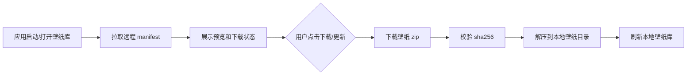

# 壁纸资源托管与下载方案

> 最后更新：2026-05-19
> 读者：产品设计、发布维护、桌面壁纸模块和后续接手开发者
> 本文用于整理灵月桌面远程壁纸资源的托管、下载、容量和更新方案。

## 0. 一句话定位

灵月桌面的安装包不应该长期携带大量壁纸资产。安装包只保留少量默认资源，完整壁纸库通过远程资源清单按需下载到本机。

推荐目标形态：

```text
安装包：应用主程序 + 少量默认壁纸
远程资源库：manifest.json + 预览图 + 壁纸资源包
本地缓存：%APPDATA%/lingyue-desk/remote-wallpapers/<wallpaper-id>/
```

这样可以让应用安装包保持轻量，也能让壁纸新增、修复和删除独立于程序版本发布。

## 当前实现状态（2026-08-18）

该方案已经接入应用：

- 客户端读取 `chengcczzjj/LingyueDesk-Wallpapers` 公开仓库的 `manifest.json`。
- 启动 20 秒后刷新清单，之后每 6 小时刷新；在线壁纸页也支持手动刷新和本地缓存回退。
- 每个壁纸独立下载 ZIP，强制限制在 2 GiB 内，并校验清单声明的文件大小和 SHA-256。
- ZIP 经过路径、符号链接、描述文件和主资源检查后，原子安装到 `userData/remote-wallpapers/<id>/`。
- 在线壁纸页支持下载、版本更新、应用和删除；当前正在使用的资源不会被误删。
- 用户导入壁纸仍位于 `userData/wallpapers/<id>/`，并支持从本地壁纸页删除。
- 所有者发布 UI 可打包本地壁纸、创建/复用 GitHub Release、上传 ZIP 和预览图，并提交更新后的 manifest。

普通正式版不会显示发布入口。所有者在完全退出应用后使用以下参数启动：

```powershell
& "$env:LOCALAPPDATA\Programs\LingyueDesk\LingyueDesk.exe" --lingyue-wallpaper-owner
```

开发模式默认显示所有者入口。发布 Token 使用 Windows DPAPI 加密保存在当前 Windows 用户的
`%APPDATA%/lingyue-desk/wallpaper-owner.json`，渲染层只能获得掩码。应用还会校验 Token 对应的
GitHub 登录必须是 `chengcczzjj` 且具备官方资源仓库写权限，因此启动参数本身不构成发布授权。

---

## 1. 为什么要拆分壁纸资源

动态壁纸资源增长很快：

| 资源类型 | 常见体积 |
| --- | ---: |
| 静态图片壁纸 | 2MB - 30MB |
| 视频动态壁纸 | 50MB - 500MB |
| 高质量视频壁纸 | 500MB - 1GB+ |
| Web 壁纸包 | 5MB - 300MB，取决于图片、视频和脚本资源 |

如果把所有壁纸放进安装包，会带来几个问题：

- 安装包越来越大，首次下载成本高。
- 每次新增壁纸都要重新发布应用。
- 用户不一定需要全部资源，却必须下载全部资源。
- Git 仓库和构建产物会快速膨胀。
- 壁纸资源更新和程序更新耦合，发布风险变高。

更适合的方式是让壁纸成为“远程内容资源”，应用只负责浏览、下载、校验、安装和删除。

---

## 2. 推荐架构



本地目录：

```text
%APPDATA%/lingyue-desk/remote-wallpapers/<wallpaper-id>/
  FlowWallDeskInfo.json
  index.html / video.mp4 / image.webp
  preview.webp
  assets/
```

当前仓库里的 `assets/wallpaper/` 继续提供内置默认资源；在线安装资源与用户导入资源分别保存，避免资源来源和更新版本互相覆盖。

---

## 3. 免费托管选择

| 方案 | 免费容量感觉 | 适合程度 | 说明 |
| --- | ---: | --- | --- |
| GitHub Releases | 单文件通常可到 GB 级，公开项目早期够用 | 推荐早期使用 | 适合 zip 包和版本化发布，不要把大资源直接提交进 Git 历史 |
| Hugging Face Datasets | 公开数据集对大文件更友好，几十 GB 到上百 GB 级别更现实 | 适合公开素材库 | 适合图片、视频、AI 资源，但要遵守平台和版权规则 |
| Cloudflare R2 | 免费额度常见为 10GB 存储级别，后续成本较低 | 推荐中长期 | 对象存储 + CDN/自定义域名，适合正式资源库 |
| Internet Archive | 对公开归档比较宽松 | 适合备份/合集 | 不适合做高频应用内资源商店主源 |

不建议作为主方案：

- Git 仓库本体：仓库会膨胀，clone 和历史维护都会变慢。
- Git LFS：免费额度较小，动态壁纸很容易用完存储和流量。
- 免费图床或网盘：直链、限速、稳定性和失效风险都不适合程序自动下载。
- npm/jsDelivr：不适合托管大量媒体资产，容易被视为滥用。

---

## 4. 容量估算

按平均 `200MB` 一个动态壁纸包估算：

```text
10 个壁纸  ≈ 2GB
50 个壁纸  ≈ 10GB
100 个壁纸 ≈ 20GB
500 个壁纸 ≈ 100GB
```

按平均 `500MB` 一个高质量视频壁纸包估算：

```text
20 个壁纸  ≈ 10GB
100 个壁纸 ≈ 50GB
200 个壁纸 ≈ 100GB
```

因此早期可以使用 GitHub Releases 放几 GB 到十几 GB 的公开资源；超过 `20GB - 50GB` 后，建议迁移到 Cloudflare R2 或类似对象存储。

---

## 5. 资源清单格式

远程入口建议固定为一个 `manifest.json`，应用通过它展示壁纸库和判断更新。

示例：

```json
{
  "version": 1,
  "updatedAt": "2026-05-19",
  "wallpapers": [
    {
      "id": "azur-lane-001",
      "title": "碧蓝航线",
      "type": "video",
      "version": "1.0.0",
      "size": 245000000,
      "previewUrl": "https://assets.lingyuedesk.com/previews/azur-lane-001.webp",
      "packageUrl": "https://github.com/chengcczzjj/LingyueDesk-Wallpapers/releases/download/2026-05/azur-lane-001.zip",
      "sha256": "...",
      "tags": ["video", "anime"],
      "author": "",
      "license": ""
    }
  ]
}
```

关键字段：

| 字段 | 用途 |
| --- | --- |
| `id` | 本地目录名和唯一标识，发布后不要随意改 |
| `version` | 壁纸包版本，用于判断是否有更新 |
| `previewUrl` | 列表预览图，尽量使用小体积 WebP |
| `packageUrl` | zip 下载地址 |
| `sha256` | 下载后校验，防止文件损坏或被替换 |
| `license` | 版权和授权信息，避免后期资源来源失控 |

---

## 6. 发布流程建议

早期 GitHub Releases 方案：

1. 单独建立 `LingyueDesk-Wallpapers` 资源仓库。
2. 每个壁纸打成独立 zip，zip 内保持现有壁纸目录结构。
3. Release 资产上传 `wallpaper-id.zip` 和可选 `wallpaper-id.zip.sha256`。
4. 更新 `manifest.json`，记录版本、大小、预览图、下载地址和校验值。
5. 应用内壁纸库拉取 manifest，显示“下载 / 更新 / 已安装”。

中长期 R2/CDN 方案：

1. GitHub 继续保存元数据和发布脚本。
2. GitHub Actions 打包壁纸并上传到 R2。
3. `manifest.json` 指向自有域名，例如 `https://assets.lingyuedesk.com/wallpapers/manifest.json`。
4. 应用端逻辑不变，只替换资源源地址。

---

## 7. 应用端能力

已实现：

- 远程 manifest 拉取、内存缓存和磁盘缓存回退。
- 远程预览图展示。
- 壁纸包下载和进度展示。
- ZIP 安全解压、内容验证和原子安装。
- SHA-256 与声明大小双重校验。
- 本地已安装版本记录和语义版本更新判断。
- 删除本地在线壁纸和对应用户覆盖配置。
- 所有者 GitHub Release 发布、预览上传和 manifest 更新。

增强版本：

- 下载中断续传。
- 多镜像源兜底。
- 壁纸包差分更新。
- 下载限速和磁盘空间检查。
- stable / beta 资源频道。
- 资源版权、作者和来源展示。

---

## 8. 与自动更新的关系

程序自动更新和壁纸资源更新应分离：

| 更新类型 | 更新方式 | 是否需要重启 |
| --- | --- | --- |
| 主进程、Electron、native 依赖、IPC 协议 | 安装包自动更新 | 通常需要 |
| Renderer 静态资源和核心代码 | 安装包自动更新，或谨慎热更新 | 视方案而定 |
| 壁纸包、预览图、资源元数据 | 远程资源下载 | 不需要 |
| Agent 提示词、推荐内容、资源清单 | 远程配置 | 通常不需要 |

壁纸资源应该走下载刷新路径，不应该为了新增一个壁纸强制用户安装新版应用。

---

## 9. 发布和使用流程

首次使用：

1. 以所有者参数启动应用，进入“壁纸资源 > 壁纸库 > 资源发布管理”。
2. 填入属于 `chengcczzjj` 的 GitHub Token。已有仓库至少需要 Contents 写权限；仓库不存在时，应用会尝试创建公开的 `LingyueDesk-Wallpapers` 仓库，此时 Token 还需要仓库创建权限。
3. 选择内置、用户导入或已下载的本地壁纸，填写稳定的资源 ID、语义版本和 Release 标签。
4. 点击“打包并发布到 GitHub”。应用会上传独立 ZIP/预览图并原子更新 manifest。
5. 普通用户打开在线壁纸库或等待后台刷新，即可看到新版本并按需下载。

版本规则：

- `id` 发布后保持不变，只使用小写字母、数字、点、下划线和短横线。
- `version` 使用 `1.0.0` 形式；更新同一资源时提高版本，不要通过换 ID 规避更新。
- `releaseTag` 可按月份复用，例如 `wallpapers-2026-08`；资产文件名包含资源版本，重试同版本会替换同名资产。
- 不要在 Token 中授予无关账户或组织权限，也不要把 Token 写入 manifest、日志或壁纸包。

当资源量超过 `20GB - 50GB`，或 GitHub 下载体验不稳定时，可把 manifest 中的下载地址迁移到 Cloudflare R2/CDN；客户端资源协议无需改变。
