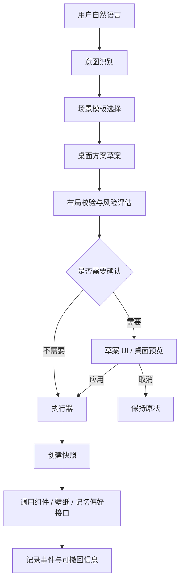

# AI 桌面编排系统设计

> 读者：产品设计、桌面组件开发、AI 工具层开发和后续接手者
> 最后更新：2026-05-29
> 关联文档：`组件模块通用设计.md`、`图标收纳组件设计.md`、`时钟组件设计.md`、`TempFile/文档资料/记忆系统/local-folder-agent-development-guide.md`

## 0. 一句话定位

AI 桌面编排不是“让模型直接改组件 JSON”，而是让灵月理解用户想要的桌面状态，通过受控协议生成桌面方案，再由确定性的布局和组件接口安全执行。

目标体验：

```text
用户：晴蓝，帮我把桌面调成晚上专注模式。
灵月：好，我把桌面收干净一点，保留 Dock，右下角放白噪音，左上角留一个轻时间。先给你预览一下。
```

用户看到的是一个可确认、可撤回的桌面方案，而不是一堆技术操作日志。

## 1. 为什么需要新设计

当前组件系统已经能添加、移动、配置和保存组件，但它更像“可拖拽的独立摆件”。如果直接把这些低级操作暴露给 AI，会出现几个问题：

| 问题 | 结果 |
| --- | --- |
| 组件能力没有统一描述 | AI 需要猜配置字段，成功率低 |
| 组件全部摊开放在桌面 | 桌面容易从“美观”变成“仪表盘” |
| 缺少场景目标 | AI 不知道应该少放、常驻、隐藏还是强化某类组件 |
| 缺少壁纸安全区 | 容易挡住人物、主体、Logo 或构图中心 |
| 缺少草案和撤回 | 用户不敢让 AI 批量调整桌面 |
| Dock/图标收纳安全等级高 | 不能像普通装饰组件一样随意移动、删除或替换 |

所以需要在现有 Widget IPC 外面新增一层“AI 可编排协议层”。模型只负责理解意图和选择方案，具体布局、校验、写入、撤回由系统完成。

## 2. 产品原则

### 2.1 默认稀疏

灵月桌面不是数据看板。默认桌面应接近 Wallpaper Engine 的审美逻辑：壁纸是主体，组件是轻量装饰和少量实用入口。

第一版默认只推荐这些元素：

- 时间 / 日期。
- 极简天气。
- 音频可视化。
- 桌面文字或便签。
- 白噪音。
- Dock / 图标收纳。
- 桌宠状态反馈暂缓，不进入首版桌面编排闭环。

新闻、股票、系统监控、日历等信息卡片只有在用户明确要求“工作模式”“信息密度”“看盘”“热点”时才出现。

### 2.2 美学优先

桌面编排首先是视觉设计问题，其次才是功能摆放问题。AI 不能只追求“把功能放上去”，还必须保证组件像壁纸的一部分。

核心美学原则：

| 原则 | 说明 |
| --- | --- |
| 壁纸是主角 | 组件不能抢走角色、场景、光影和构图中心 |
| 组件像字幕而不是窗口 | 默认轻、薄、低边界，避免像网页卡片贴在桌面上 |
| 视觉重量可控 | 时间、天气、文字、音频可视化可以轻；新闻、股票、系统监控必须克制 |
| 一张桌面一个视觉锚点 | 默认只允许一个主视觉组件，例如大时间或音频可视化 |
| 边缘优先，中心谨慎 | 中心区域默认留给壁纸主体，组件优先贴近边缘、角落和留白 |
| 成组出现 | 时间和天气、文字和白噪音、Dock 和启动入口应形成小组，而不是散落 |
| 同色系但不糊成一片 | 颜色来自壁纸主色/辅助色，但要保留足够对比度 |
| 动效柔和 | 组件出现、移动、隐藏要像桌面自己调整了呼吸，不像窗口突然弹出 |

第一版允许 AI 牺牲部分功能密度，也不要破坏桌面的第一眼美感。

### 2.3 Dock 常驻保护

图标收纳和 Dock 是用户的桌面入口，不是普通装饰。AI 编排时默认遵守：

- 不删除 Dock。
- 不清空 Dock。
- 不导入、恢复、启动、移除图标，除非用户明确要求并确认。
- 可以在低风险范围内调整透明度、大小、方向、标题显示。
- 移动 Dock 或改变图标收纳形态需要轻确认。

### 2.4 模型不直接写代码

AI 不能通过写代码、改源码、猜 JSON 字段来操作桌面。它只能调用受控工具：

- 读取当前桌面状态。
- 生成桌面草案。
- 应用经过校验的场景 patch。
- 撤回最近一次桌面编排。

底层仍然可以复用 `WIDGET_LIST`、`WIDGET_ADD`、`WIDGET_UPDATE`、`WIDGET_UPDATE_CONFIG`、`WIDGET_REMOVE`，但这些低级 IPC 不应成为模型直接乱调的主要入口。

### 2.5 先预览，后应用

凡是会明显改变桌面视觉、移动多个组件、影响 Dock 或播放声音的方案，都应先生成草案。

低风险小改动可以直接执行，例如：

- “把文字透明一点。”
- “天气换成极简样式。”
- “白噪音音量小一点。”

中高风险改动必须确认，例如：

- “帮我重新布置桌面。”
- “切成工作模式。”
- “把图标都收起来。”
- “移除所有信息卡片。”

## 3. 视觉编排规则

### 3.1 视觉层级

每个桌面方案都应先确定视觉层级，再决定功能。

| 层级 | 作用 | 组件例子 | 默认视觉重量 |
| --- | --- | --- | --- |
| 壁纸主体 | 画面主角，不被遮挡 | 人物、场景、Logo、中心光影 | 最高 |
| 主视觉组件 | 桌面的唯一功能锚点 | 大时间、音频可视化、图形日期 | 中高 |
| 辅助信息 | 与主视觉组件成组 | 极简天气、短句、日期、小状态 | 低 |
| 常驻入口 | 稳定但低打扰 | Dock、图标收纳 | 中低 |
| 临时反馈 | 只在操作过程出现 | 草案预览、撤回提示、聊天状态 | 低，短时 |
| 信息卡片 | 功能密度高，容易破坏桌面 | 新闻、股票、系统监控、日历 | 中高，按需出现 |

默认场景中，主视觉组件最多一个，辅助信息最多两个，信息卡片默认不出现。

### 3.2 构图方式

AI 布局时应使用构图规则，而不是只找空位。

| 构图方式 | 适用壁纸 | 组件摆放建议 |
| --- | --- | --- |
| 角落留白型 | 人物或主体在中心 | 时间/天气放左上或右上，Dock 放底部 |
| 侧边主体型 | 人物在左或右 | 组件放另一侧留白，避免覆盖脸和手部 |
| 中心海报型 | 中间是标题、角色或强光源 | 只使用边缘轻组件，中心完全留空 |
| 横向风景型 | 风景、远景、桌面空间大 | 音频可视化可贴底部，时间可做海报式排版 |
| 暗色氛围型 | 夜景、房间、霓虹 | 使用低亮度文字、细描边、弱发光 |
| 高饱和插画型 | 颜色复杂 | 组件减少颜色，使用白/黑/半透明单色 |

布局引擎应把 `safeAreas` 当成“优先留白区”，把 `avoidAreas` 当成“审美禁区”，而不只是技术碰撞区。

### 3.3 组件材质

组件外观需要按场景选择材质。不同组件不能各自为政。

| 材质 | 适合组件 | 适合场景 | 设计要求 |
| --- | --- | --- | --- |
| 纯文字 | 时间、日期、短句、极简天气 | 极简、夜间、海报感 | 无卡片底，靠阴影/描边保证可读 |
| 轻毛玻璃 | Dock、白噪音、天气、小卡片 | 日常、工作、浅色壁纸 | 透明度高，边框弱，圆角克制 |
| 霓虹线条 | 音频可视化、像素时钟 | 音乐、科技、暗色壁纸 | 发光弱，不满屏闪烁 |
| 像素块面 | 像素时钟、桌宠状态 | 像素风、游戏风 | 保持硬边，不混用过多毛玻璃 |
| 信息卡片 | 新闻、股票、系统监控 | 工作、资讯、看盘 | 卡片数量少，边界清楚，密度可扫读 |

AI 选择组件时，应优先继承当前场景材质。例如夜间专注场景中，时间、天气、文字都应走“纯文字 / 低亮度 / 弱阴影”，不要混入厚重信息卡。

### 3.4 色彩与可读性

色彩不应该由模型自由发挥，应由系统从壁纸和主题中选择。

推荐规则：

- 深色壁纸：浅色文字、低透明描边、弱发光。
- 浅色壁纸：深色文字、柔和投影、低饱和辅助色。
- 多彩壁纸：使用单色组件，避免彩虹式叠加。
- 冷色壁纸：可以使用蓝、青、白、银灰。
- 暖色壁纸：可以使用米白、淡橙、玫瑰、深棕。
- 强霓虹壁纸：组件降低饱和度，只保留局部强调。

最低可读性约束：

- 时间数字必须在 1 秒内可读。
- 天气温度和状态必须在正常观看距离下清楚。
- 桌面短句不能超过两行。
- 卡片文字不能贴边，不能压住毛玻璃高亮区域。

### 3.5 出现、移动与隐藏动效

桌面编排的动效要服务“自然变化”，不能像后台管理系统刷新列表。

| 动作 | 推荐动效 | 禁止体验 |
| --- | --- | --- |
| 新组件出现 | 轻微淡入 + 4 到 8px 位移 | 突然闪现、弹窗式跳出 |
| 组件移动 | 平滑滑行，路径短 | 大幅飞来飞去 |
| 组件隐藏 | 淡出并保留撤回入口 | 直接消失且无说明 |
| 场景切换 | 分组错峰 120 到 240ms | 所有组件同时剧烈变化 |
| Dock 调整 | 保持边缘稳定，只微调透明度/大小 | Dock 位置突然换边 |
| 聊天反馈 | 一句话说明草案、应用和回滚状态 | 冗长解释打断桌面体验 |

动效时长建议：

```text
轻改动：120ms - 180ms
组件入场：180ms - 260ms
场景切换：260ms - 420ms
撤回恢复：180ms - 300ms
```

### 3.6 AI 草案中的美学说明

AI 给用户展示草案时，不只说功能，还要说明美学理由。

好的反馈：

```text
我会保留底部 Dock，把时间放到左上角的暗部留白里，天气缩成一行跟在下面。中间的人物区域不动，桌面会更安静。
```

不好的反馈：

```text
将添加 graphicdatetime、weather、whitenoise 三个组件，坐标为 x=120 y=80。
```

草案卡应包含：

- 使用的视觉风格。
- 主视觉组件是谁。
- 哪些区域被刻意留空。
- 哪些组件被弱化或隐藏。
- 为什么这样不会挡壁纸。

## 4. 系统分层



### 4.1 桌面场景层

负责把用户意图转换为场景目标。

典型场景：

| 场景 | 目标 | 默认组件 |
| --- | --- | --- |
| 极简模式 | 减少信息干扰，突出壁纸 | Dock、轻时间、极简天气 |
| 夜间专注 | 暗色、安静、少组件 | Dock、时间、白噪音、低透明文字 |
| 音乐氛围 | 强化节奏和视觉动感 | Dock、音频可视化、时间 |
| 工作模式 | 保留入口和必要信息 | Dock、日历、天气、系统监控 |
| 资讯模式 | 快速看热点 | Dock、新闻、天气、时间 |
| 看盘模式 | 股票信息优先 | Dock、股票、时钟、天气 |
| 休息模式 | 降低任务感 | Dock、白噪音、柔和文字 |

### 4.2 组件能力层

每种组件必须登记可被 AI 理解和操作的能力。AI 不再根据组件文件名猜字段。

建议新增 `WidgetCapability`：

```ts
export interface WidgetCapability {
  type: string
  displayName: string
  layer: 'persistent' | 'ambient' | 'information' | 'companion'
  role: string
  intents: string[]
  defaultSize: { width: number; height: number }
  minSize?: { width: number; height: number }
  maxSize?: { width: number; height: number }
  allowMultiple: boolean
  persistent: boolean
  canAutoHide: boolean
  aesthetics: WidgetAestheticHints
  configSchema: WidgetConfigField[]
  presets: WidgetPreset[]
  layoutHints: WidgetLayoutHints
  allowedOps: WidgetOperation[]
  risk: 'low' | 'medium' | 'high'
}
```

其中 `aesthetics` 描述组件的视觉表现边界：

```ts
export interface WidgetAestheticHints {
  visualWeight: 'quiet' | 'normal' | 'strong'
  material: 'text-only' | 'glass' | 'neon' | 'pixel' | 'card'
  maxDefaultInstances: number
  canBeHero: boolean
  shouldGroupWith?: string[]
  wallpaperContrast: 'auto' | 'light-on-dark' | 'dark-on-light'
}
```

其中 `layoutHints` 描述放置习惯：

```ts
export interface WidgetLayoutHints {
  preferredAnchors: DesktopAnchor[]
  avoidAnchors?: DesktopAnchor[]
  avoidCenter: boolean
  reserveEdge?: 'top' | 'right' | 'bottom' | 'left'
}
```

### 4.3 壁纸布局元数据层

每张壁纸应能提供“适合放组件的位置”。这比让 AI 看图猜测更稳定。

建议在壁纸目录中新增可选文件：

```text
assets/wallpaper/<id>/desktop-layout.json
userData/wallpaper-overrides/<wallpaperId>/desktop-layout.json
```

示例：

```json
{
  "version": 1,
  "wallpaperId": "bedroom-firefly",
  "moodTags": ["night", "soft", "anime", "quiet"],
  "dominantTone": "dark",
  "composition": "center-subject",
  "palette": {
    "primary": "#dbeafe",
    "secondary": "#f0abfc",
    "textOnDark": "#f8fafc",
    "textOnLight": "#1f2937"
  },
  "safeAreas": [
    { "id": "top-left", "anchor": "top-left", "rect": [0.04, 0.06, 0.28, 0.22] },
    { "id": "bottom-right", "anchor": "bottom-right", "rect": [0.68, 0.72, 0.28, 0.20] }
  ],
  "avoidAreas": [
    { "id": "character-face", "rect": [0.36, 0.18, 0.28, 0.36], "reason": "main-subject" }
  ],
  "recommendedWidgets": ["graphicdatetime", "weather", "audio"],
  "aestheticHints": {
    "preferredMaterials": ["text-only", "light-glass"],
    "maxVisibleWidgets": 3,
    "avoidCardWidgets": true
  },
  "defaultScene": "minimal"
}
```

坐标统一使用 0 到 1 的相对比例，布局引擎再转换成当前屏幕像素。没有元数据时，系统使用保守默认：避开中心，优先四角和边缘。

### 4.4 布局引擎层

布局引擎必须是确定性的，不由模型自由摆放。

输入：

- 当前屏幕尺寸。
- 当前壁纸元数据。
- 当前组件列表。
- Dock / 图标收纳保护区。
- 场景模板。
- 用户指令中的显式位置要求。

输出：

- 新增组件列表。
- 修改组件布局。
- 隐藏或弱化的组件。
- 风险评估。
- 可撤回快照。

布局原则：

| 原则 | 说明 |
| --- | --- |
| 壁纸主体优先 | 避开 `avoidAreas` 和屏幕中心主体区 |
| Dock 优先 | Dock 所在边缘保留安全距离 |
| 少即是多 | 未明确要求时不主动加入信息卡片 |
| 主次分明 | 只保留一个主视觉组件，其他组件降低视觉重量 |
| 材质一致 | 同一场景尽量使用同一材质语言 |
| 稳定位置 | 同一场景多次应用不应大幅漂移 |
| 不重叠 | 复用现有碰撞、边界和吸附能力 |
| 小屏适配 | 低分辨率下优先隐藏信息层，保留常驻层和核心装饰 |

## 5. 组件分层与首版策略

### 5.1 常驻基础层

| 组件 | 类型 | AI 默认策略 |
| --- | --- | --- |
| Dock | `desktop-icons-dock` | 保留，最多调透明度、大小、停靠边 |
| 图标收纳盒 | `desktop-icons-box` / `desktop-icons-horizontal` / `desktop-icons-adaptive` | 保留，不自动清空，不自动恢复图标 |

这些组件参与布局计算，但不被场景模板随意替换。

### 5.2 氛围装饰层

| 组件 | 类型 | 推荐使用 |
| --- | --- | --- |
| 时钟 | `clock` / `elegantclock` / `pixelclock` / `graphicdatetime` | 所有场景可用，通常只保留一个 |
| 极简天气 | `weather` | 与时钟组合，默认小尺寸 |
| 音频可视化 | `audio` | 音乐、氛围、展示场景 |
| 桌面文字 | `text` | 便签、短句、今日目标 |
| 白噪音 | `whitenoise` | 专注、休息、夜间场景 |

这是 AI 编排的主力层。

### 5.3 信息卡片层

| 组件 | 类型 | 默认策略 |
| --- | --- | --- |
| 日历 | `calendar` | 工作/计划场景出现 |
| 新闻 | `news` | 资讯场景出现 |
| 股票 | `stocks` | 看盘场景出现 |
| 系统监控 | `sysmonitor` | 工作/性能场景出现，必须接真实数据后再作为首发重点 |
| 快捷工具 | `quicktools` | 首版可保留手动添加，不作为 AI 编排核心 |

信息卡片视觉权重高，应默认少放。

### 5.4 伴侣反馈层

现阶段不把桌宠动作联动作为 P4 目标。桌宠可以继续作为聊天界面的氛围存在，但桌面编排主线先只做草案、应用、回滚和偏好记忆，避免首版范围失焦。

首版反馈由聊天过程 UI 和桌面幽灵预览承担：

| 编排阶段 | 反馈方式 | 表现 |
| --- | --- | --- |
| 理解意图 | 聊天短句 | 说明正在读取当前桌面和组件能力 |
| 生成草案 | 草案卡 + 幽灵预览 | 展示将新增、调整、弱化哪些组件 |
| 应用布局 | 结果卡 | 说明已应用并创建回滚快照 |
| 回滚布局 | 结果卡 | 说明恢复到了哪次应用前 |
| 失败或不确定 | 聊天短句 | 提一个问题，不编造成功 |

## 6. 场景模板协议

建议新增 `DesktopSceneTemplate`：

```ts
export interface DesktopSceneTemplate {
  id: string
  displayName: string
  intents: string[]
  moodTags: string[]
  density: 'minimal' | 'balanced' | 'dense'
  aestheticStyle: 'minimal' | 'soft' | 'neon' | 'pixel' | 'workbench' | 'poster'
  maxVisibleWidgets: number
  heroWidget?: string
  wallpaperPreference?: string[]
  keepPersistentLayer: true
  widgets: SceneWidgetRule[]
  hiddenWidgetLayers?: WidgetCapability['layer'][]
  petState?: string // reserved，首版/P4 不接入桌宠联动
}
```

示例：

```json
{
  "id": "night-focus",
  "displayName": "夜间专注",
  "intents": ["focus", "night", "study", "work"],
  "moodTags": ["quiet", "dark", "soft"],
  "density": "minimal",
  "aestheticStyle": "soft",
  "maxVisibleWidgets": 3,
  "heroWidget": "graphicdatetime",
  "keepPersistentLayer": true,
  "widgets": [
    {
      "type": "graphicdatetime",
      "preset": "quiet-date",
      "anchor": "top-left",
      "required": true
    },
    {
      "type": "weather",
      "preset": "minimal",
      "anchor": "top-left",
      "attachTo": "graphicdatetime"
    },
    {
      "type": "whitenoise",
      "preset": "rain-low",
      "anchor": "bottom-right",
      "requiresConfirm": true
    }
  ],
  "hiddenWidgetLayers": ["information"],
  "petState": "arranging"
}
```

## 7. 桌面方案草案

AI 生成的不是最终写入，而是 `DesktopSceneDraft`。

```ts
export interface DesktopSceneDraft {
  id: string
  title: string
  userRequest: string
  sceneId: string
  summary: string
  aestheticSummary: string
  visualPlan: {
    style: string
    heroWidget?: string
    preservedEmptyAreas: string[]
    colorStrategy: string
    motionStyle: string
  }
  wallpaperChange?: WallpaperPatch
  widgetPatches: WidgetPatch[]
  petPatch?: PetPatch // reserved，首版/P4 不接入桌宠联动
  risks: DesktopSceneRisk[]
  requiresConfirmation: boolean
  rollbackLabel: string
}
```

`WidgetPatch` 只允许表达受控操作：

```ts
export type WidgetPatch =
  | { op: 'create'; type: string; preset?: string; layout: LayoutPatch; config?: Record<string, unknown> }
  | { op: 'update-layout'; id: string; layout: LayoutPatch }
  | { op: 'update-config'; id: string; config: Record<string, unknown> }
  | { op: 'hide'; id: string; reason: string }
  | { op: 'restore'; id: string }
  | { op: 'remove'; id: string; requiresConfirmation: true }
```

第一版建议避免真实删除，优先 `hide` 或 `disable`。删除只在用户明确要求时出现。

## 8. AI 工具层

当前已有 `list_widgets`、`add_widget`、`update_widget_config`、`remove_widget`。这些可以继续保留，但应该新增高阶桌面编排工具。

| 工具 | 作用 | 风险 |
| --- | --- | --- |
| `desktop_scene_get` | 读取当前壁纸、组件、Dock、安全区和场景状态 | 低 |
| `desktop_scene_draft` | 根据用户意图生成结构化草案，不写入 | 低 |
| `desktop_scene_apply` | 应用已校验草案，创建快照并写入 userData | 中 |
| `desktop_scene_rollback` | 撤回最近一次桌面编排 | 中 |
| `desktop_scene_set_mode` | 套用内置场景模板 | 中 |
| `widget_capability_list` | 返回可编排组件能力表 | 低 |
| `wallpaper_layout_get` | 返回当前壁纸安全区和推荐组件 | 低 |
| `desktop_aesthetic_check` | 检查草案是否遮挡主体、过密、材质混乱或对比度不足 | 低 |

工具返回给模型的内容要短，给 UI 的结构要完整。

模型看到：

```text
已生成夜间专注草案，包含 3 个组件调整，需要确认。
```

UI 收到：

```json
{
  "draftId": "scene-draft-xxx",
  "affectedWidgets": 3,
  "requiresConfirmation": true,
  "risks": ["play-audio", "move-dock-near-edge"]
}
```

## 9. 确认、权限与风险

| 行为 | 风险 | 默认策略 |
| --- | --- | --- |
| 修改颜色、透明度、文字内容 | 低 | 可直接执行，保留撤回 |
| 添加一个轻装饰组件 | 低/中 | 可直接执行或轻确认 |
| 移动、缩放多个组件 | 中 | 展示草案 |
| 隐藏信息卡片 | 中 | 展示草案 |
| 播放白噪音或改变音量 | 中 | 首次播放需要确认 |
| 更换壁纸 | 中 | 展示草案 |
| 移动 Dock | 中/高 | 需要确认 |
| 导入、恢复、移除图标 | 高 | 必须确认 |
| 启动外部程序 | 高 | 必须确认 |
| 删除组件 | 高 | 优先隐藏；删除必须确认 |

风险确认文案要像角色对话，不要像系统警告：

```text
我可以这么布置，不过会把几个信息卡片先收起来。要我动手吗？
```

## 10. 美学质量检查

每个桌面草案在应用前都应跑一次美学检查。它不是主观评分，而是明确的可执行约束。

### 10.1 检查项

| 检查项 | 通过标准 |
| --- | --- |
| 主体遮挡 | 新组件不覆盖 `avoidAreas` |
| 可见组件数量 | 默认场景不超过 Dock + 3 个轻组件 |
| 主视觉数量 | `canBeHero` 组件最多一个 |
| 信息卡片数量 | 非信息场景为 0，工作/资讯场景最多 2 个 |
| 材质一致性 | 同场景不混用 3 种以上材质 |
| 色彩一致性 | 组件主色来自壁纸 palette 或主题 |
| 对比度 | 文字和背景有足够明暗差 |
| 边缘呼吸感 | 组件距离屏幕边缘和 Dock 有安全间距 |
| 分组关系 | 天气贴近时间，白噪音贴近文字或角落 |
| 动效强度 | 场景切换不使用夸张弹跳和大位移 |

### 10.2 失败处理

如果美学检查失败，系统应优先自动修正：

- 过密：隐藏信息卡片或减少辅助组件。
- 遮挡主体：移动到安全区。
- 对比不足：切换明暗文字或加弱描边。
- 材质混乱：统一为当前场景的主要材质。
- Dock 被挤压：缩小或移动普通组件，不移动 Dock。

如果无法修正，草案不应直接应用，应让灵月自然说明：

```text
这张壁纸中间太关键了，我不想把东西硬盖上去。要不我只保留左上角时间和底部 Dock？
```

## 11. 快照与撤回

AI 编排必须有轻撤回，不等同于复杂文件 checkpoint。

建议新增：

```ts
export interface DesktopSceneSnapshot {
  id: string
  createdAt: number
  wallpaperId: string
  reason: string
  source: 'user' | 'ai-scene'
  beforeWidgets: WidgetInstance[]
  afterWidgets?: WidgetInstance[]
  beforeWallpaperSettings?: Record<string, unknown>
  afterWallpaperSettings?: Record<string, unknown>
}
```

保存位置：

```text
userData/desktop-scenes/snapshots/<snapshotId>.json
```

保留策略：

- 最近 20 次编排快照。
- 每次快照只保存运行时配置，不保存内置资源。
- 撤回只恢复组件布局、组件配置和壁纸设置覆盖。
- 不恢复用户文件、不回滚 Dock 托管目录真实文件操作。

## 12. 记忆系统接入

桌面编排会产生两类信息：

| 类型 | 是否进入长期记忆 | 示例 |
| --- | --- | --- |
| 当前状态 | 否，进入 Current State | 当前处于夜间专注模式 |
| 稳定偏好 | 是，用户确认后进入长期记忆 | 用户喜欢右下角白噪音、左上角时间 |
| 一次性布局 | 否 | 今天临时放一个提醒 |
| 失败或异常 | 视情况 | 某壁纸没有安全区元数据 |

建议 current state key：

```text
desktop.current_scene
desktop.current_wallpaper_layout
desktop.last_scene_snapshot
desktop.dock_position
```

建议长期记忆 scope：

```text
companion:layout-preference
tool:desktop-scene-preference
```

## 13. UI 形态

### 13.1 聊天草案卡

草案卡应显示：

- 场景名称。
- 视觉风格，例如极简、柔和、霓虹、像素、工作台。
- 主视觉组件。
- 会保留什么。
- 会新增什么。
- 会隐藏或弱化什么。
- 是否会播放声音、移动 Dock、换壁纸。
- 哪些区域会刻意留空。
- 按钮：应用、再改改、取消。

不要展示完整 JSON。

### 13.2 桌面幽灵预览

在确认前，画布可以显示半透明预览：

- 新组件淡入为虚线边框或低透明状态。
- 将移动的组件显示目标位置。
- 被隐藏组件变暗。
- Dock 保护区显示轻微边界。

### 13.3 完成反馈

完成后给一句自然反馈，并提供短时间撤回入口：

```text
好了，桌面现在安静多了。右下角给你留了雨声，时间放左上角，不挡画面。
```

```text
[撤回刚才布置]
```

## 14. 和现有实现的关系

| 现有模块 | 复用方式 |
| --- | --- |
| `src/shared/types.ts` | 扩展桌面场景、组件能力和快照类型 |
| `src/main/ipc/widgetIpc.ts` | 继续作为最终组件写入和同步入口 |
| `src/main/memory/tools/definitions/widgets.ts` | 保留低级工具，新增桌面场景工具 |
| `src/main/memory/tools/toolRouter.ts` | 增加桌面编排意图识别 |
| `src/main/memory/routing/contextPacker.ts` | 强化“少放组件、先草案、可撤回”的提示 |
| `src/renderer/main-ui/pages/chat/ChatPage.tsx` | 新增桌面草案卡和撤回入口 |
| `src/renderer/canvas/Canvas.tsx` | 新增幽灵预览和批量动画 |
| `src/renderer/shared/pixel-pet.ts` | 暂不进入首版编排闭环；后续如恢复桌宠联动再单独接入 |
| `src/main/runtime/userDataPaths.ts` | 增加 desktop scene 快照、壁纸布局覆盖路径 |

## 15. 第一版最小闭环

第一版不要追求“AI 什么都能布置”。建议只做 3 个高质量场景：

### 15.1 极简桌面

- 保留 Dock。
- 保留或创建一个时钟。
- 可选极简天气。
- 隐藏新闻、股票、系统监控。
- 桌宠联动暂缓，完成反馈先由聊天过程 UI 承担。
- 美学要求：纯文字或轻毛玻璃，最多一个主视觉时间组件，屏幕中心留空。

### 15.2 夜间专注

- 保留 Dock。
- 使用暗色/低透明时间组件。
- 可选白噪音，首次播放需确认。
- 可选一句桌面文字，例如“今晚只做一件事”。
- 信息卡片全部隐藏。
- 美学要求：低亮度、弱发光、少颜色，组件集中在一个角落或一条边。

### 15.3 音乐氛围

- 保留 Dock。
- 添加或调整音频可视化。
- 时间弱化到角落。
- 隐藏大卡片。
- 桌宠联动暂缓，完成反馈先由聊天过程 UI 承担。
- 美学要求：音频可视化作为主视觉，贴底部或留白边缘，不覆盖壁纸主体。

这三个场景足够拍首发演示视频，也能证明灵月和 Wallpaper Engine 的差异：不是只有壁纸，而是能理解并整理桌面状态。

## 16. 开发路线

### P0：协议和元数据

- 新增 `WidgetCapability` 注册表。
- 给现有组件补齐 layer、intents、presets、layoutHints、allowedOps。
- 给现有组件补齐 aesthetics：visualWeight、material、canBeHero、shouldGroupWith。
- 新增 `desktop-layout.json` 读取逻辑，缺省时用保守布局。
- 定义 `DesktopSceneTemplate`、`DesktopSceneDraft`、`DesktopSceneSnapshot` 类型。

### P1：确定性布局和快照

- 实现布局引擎：锚点、避让、Dock 保护区、碰撞校验。
- 实现美学检查：遮挡、密度、主视觉、材质、对比度。
- 新增桌面编排快照和撤回。
- 先在本地函数层打通，不急着给模型开放全部能力。

### P2：AI 工具和草案 UI

- 新增 `desktop_scene_get/draft/apply/rollback`。
- Chat UI 增加草案卡。
- Canvas 增加幽灵预览。
- Tool Router 将“布置桌面、专注模式、音乐模式、极简模式”路由到桌面编排工具。

### P3：草案应用、快照和回滚

- 新增 `desktop_scene_apply/rollback`。
- 应用前自动创建桌面编排快照。
- 应用后清除幽灵预览，并在聊天里显示可回滚结果。
- 回滚只恢复组件布局、启用状态和配置，不回滚真实桌面文件操作。

### P4：记忆偏好

- 将用户确认后的稳定布局偏好写入记忆候选。
- 支持用户说“以后专注模式都这样摆”。
- 记住组件取舍、常用锚点、信息密度和美学风格偏好。
- 不做桌宠动作联动，避免首版桌面编排范围失焦。

### P5：扩展场景和壁纸智能化

- 为内置壁纸补 `desktop-layout.json`。
- 支持用户手动标注壁纸安全区。
- 支持更多场景模板和用户自定义场景。
- 远程壁纸包可以携带推荐组件布局和安全区。

## 17. 验收标准

| 目标 | 验收方式 |
| --- | --- |
| AI 不猜字段 | 所有桌面编排写入都通过 schema 校验 |
| 桌面不乱 | 默认场景最多保留 Dock + 2 到 3 个轻组件 |
| Dock 不被误伤 | 场景切换不删除、不清空 Dock |
| 可预览 | 中风险以上编排展示草案 |
| 可撤回 | 应用后能恢复到上一布局 |
| 壁纸不被遮挡 | 遵守 safeAreas / avoidAreas |
| 美学不过载 | 主视觉最多一个，材质不混乱，信息卡片按需出现 |
| 组件像壁纸的一部分 | 色彩、透明度、动效和构图与壁纸匹配 |
| 编排反馈存在 | 聊天反馈能说明草案、应用结果和可回滚状态 |
| 首发可演示 | 30 秒内能展示一句话切换桌面场景 |

## 18. 暂缓项

这些功能有价值，但不应阻塞第一版：

- 自动识别壁纸主体区域的视觉模型。
- 用户自定义复杂规则引擎。
- AI 生成全新组件代码。
- 多屏幕复杂布局。
- 自动下载并切换远程壁纸库。
- 大范围整理桌面真实文件。
- 与系统日程、邮件、浏览器历史深度联动。

第一版核心是“受控、少量、漂亮、可撤回”。只要这条体验顺，灵月的特色就会从已有底座里长出来。
