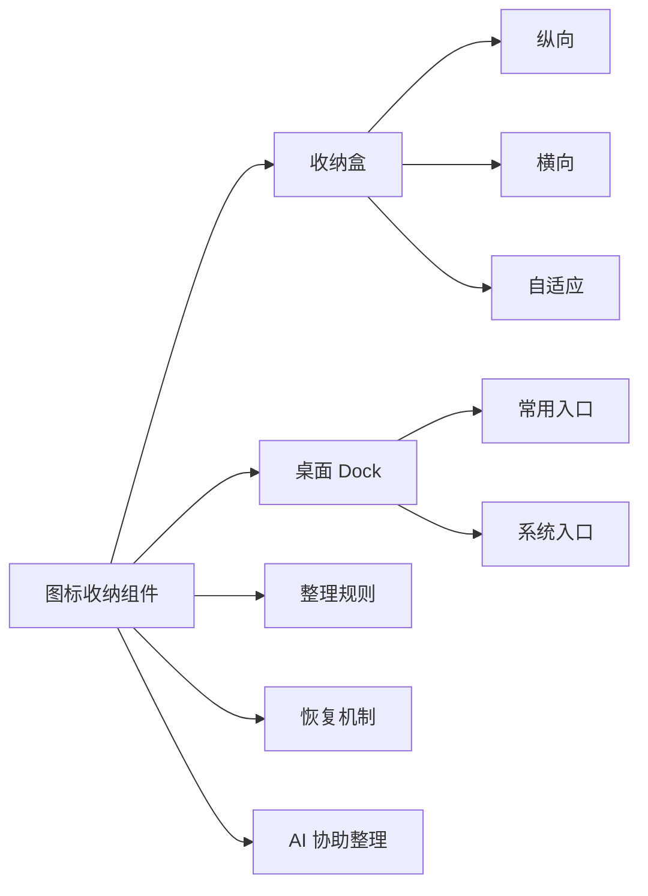
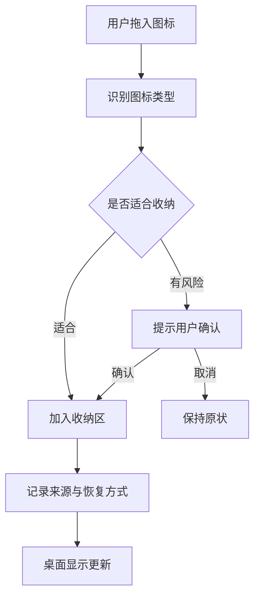
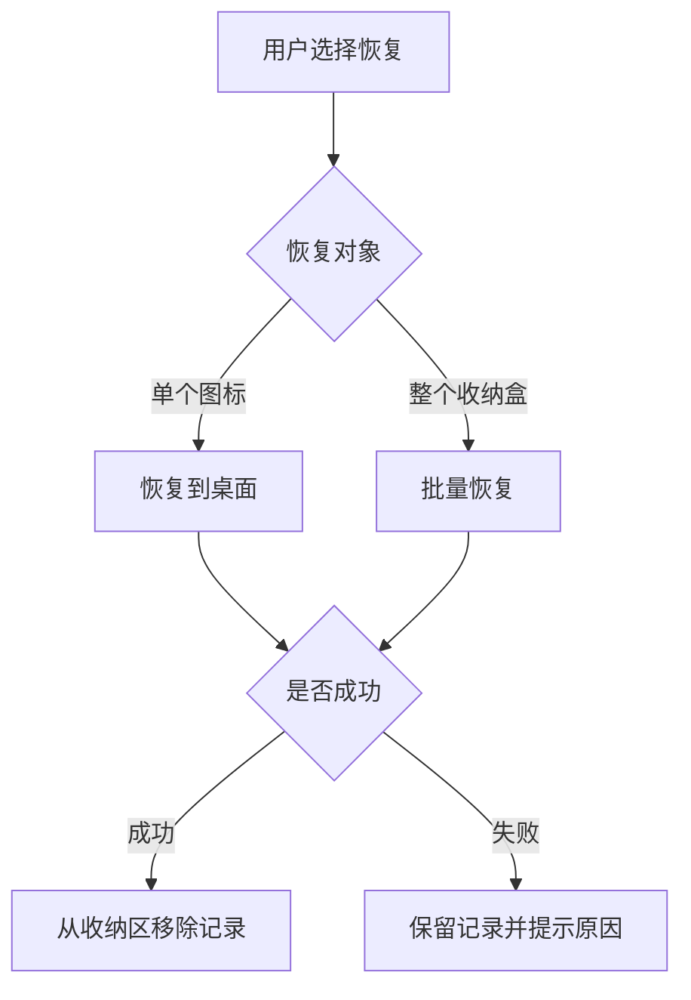
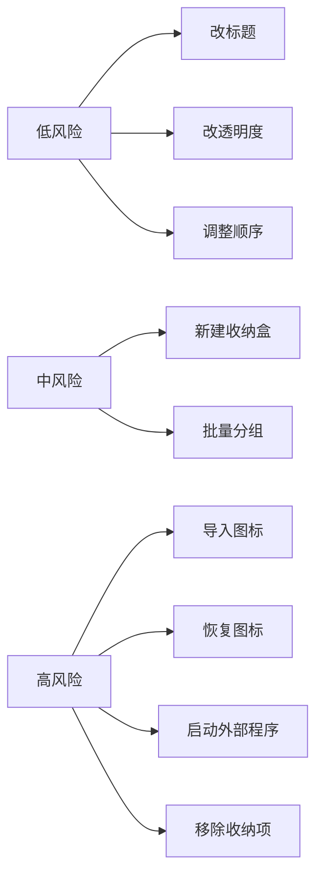

# 图标收纳组件设计

> 这是一份给产品设计、开发和 Agent 协作使用的设计文档。它说明图标收纳的使用体验、整理逻辑和安全边界，不展开底层实现细节。

## 一句话定位

图标收纳组件是桌面快捷方式的整理工具。它帮助用户把桌面图标收起来、分好类、还能随时打开和恢复。

## 核心承诺

| 承诺 | 对用户意味着什么 |
| --- | --- |
| 收得进去 | 图标可以被拖入收纳区 |
| 找得到 | 收纳后仍然清楚知道每个图标是什么 |
| 打得开 | 从收纳区里可以继续启动应用、文件或链接 |
| 还得回 | 用户想恢复时，可以把图标放回桌面 |
| 不乱动 | 不在用户不知情时移动、删除或覆盖文件 |
| 能变美 | 收纳区外观能融入当前壁纸 |

## 组件关系图

## 当前形态

| 形态 | 适合放在哪里 | 适合收纳什么 | 设计重点 |
| --- | --- | --- | --- |
| 纵向收纳盒 | 屏幕左侧或右侧 | 开发工具、办公入口 | 窄、稳、易扫视 |
| 横向收纳盒 | 顶部或底部 | 一组常用应用 | 排列清楚，不占高度 |
| 自适应收纳盒 | 留白区域 | 数量变化较多的图标 | 自动排布，减少手调 |
| 桌面 Dock | 屏幕底部 | 高频启动项 | 手感轻快，视觉更精致 |

## 收纳流程

## 收纳规则

| 图标类型 | 默认策略 | 原因 |
| --- | --- | --- |
| 应用快捷方式 | 可以收纳 | 风险较低，恢复路径清楚 |
| 网页快捷方式 | 可以收纳 | 需要保留原链接 |
| 普通文件 | 默认只登记，不主动移动 | 避免误挪用户文件 |
| 文件夹 | 默认只登记，不主动移动 | 文件夹可能包含大量内容 |
| 不确定类型 | 放入“待确认” | 避免 Agent 猜错 |

## 恢复流程

## AI 协助整理

AI 可以帮助用户整理桌面，但必须先给计划，再执行。

| 用户可以这样说 | Agent 应该做什么 | 是否需要确认 |
| --- | --- | --- |
| “帮我把开发工具收在一起” | 找出可能的开发工具，生成整理计划 | 需要 |
| “把 Dock 调透明一点” | 调整 Dock 外观 | 不需要 |
| “把这些图标按工作和娱乐分组” | 生成分组建议 | 执行前需要 |
| “恢复这个收纳盒里的图标” | 恢复图标到桌面 | 需要 |
| “打开 VS Code” | 启动指定图标 | 需要 |
| “这个收纳盒改名叫工作” | 修改标题 | 不需要 |

## 安全边界

图标收纳涉及用户桌面文件，因此安全优先级高于美观和自动化。

| 行为 | 规则 |
| --- | --- |
| 整理前 | 先展示计划 |
| 执行前 | 对导入、恢复、启动、移除请求确认 |
| 执行中 | 记录原位置和恢复方式 |
| 执行失败 | 保留收纳记录，不丢数据 |
| 不确定时 | 放入待确认，不自动归类 |

## 外观设计方向

| 外观项 | 设计目标 |
| --- | --- |
| 背景 | 轻量毛玻璃，不抢壁纸主体 |
| 标题 | 可显示分组名，也可隐藏 |
| 图标大小 | 支持舒适、标准、紧凑 |
| 标签 | 可显示、隐藏或仅悬停显示 |
| Dock | 可做悬浮放大、边缘停靠、低透明状态 |
| 壁纸适配 | 根据壁纸亮暗自动调整透明度和文字颜色 |

### Dock 启动动画规范

| 动画项 | 规格 |
| --- | --- |
| 统一范围 | Dock 应用、设置、资源管理器、回收站与普通收纳图标使用同一反馈 |
| 图标缩放 | 500ms 反馈窗口内按 `1 → 0.82 → 1.06 → 1` 播放，缩放段持续 380ms |
| 缩放曲线 | `cubic-bezier(0.28, 0, 0.42, 1)`，先按下、轻微放大再回到原尺寸 |
| 扩散叠影 | 图标副本以 0.7 透明度出现，延迟 150ms 后放大到 2.6 倍并淡出 |
| 扩散曲线 | 480ms，`cubic-bezier(0.22, 0, 0.36, 1)` |
| Dock 悬停 | 启动反馈期间暂时回到基础尺寸，避免与悬停放大叠乘；结束后恢复悬停行为 |
| 系统按钮 | 设置、资源管理器和回收站使用统一反馈；回到桌面不播放动画 |

## 典型场景

| 场景 | 推荐形态 | 原因 |
| --- | --- | --- |
| 桌面图标很多 | 自适应收纳盒 | 自动容纳数量变化 |
| 常用应用启动 | Dock | 更快、更像入口 |
| 工作项目分类 | 纵向收纳盒 | 分组清楚，适合侧边 |
| 临时资料入口 | 横向收纳盒 | 不占主要视觉区域 |
| 极简桌面 | 透明收纳盒 | 保持干净 |

## 后续完善方向

| 优先级 | 方向 | 价值 |
| --- | --- | --- |
| 高 | 明确导入和恢复策略 | 避免误伤用户文件 |
| 高 | 增加整理前预览 | 让 AI 整理更可信 |
| 高 | 支持单个图标拖出恢复 | 更符合桌面直觉 |
| 中 | 按类型、项目、使用频率分组 | 提升整理效率 |
| 中 | 多套桌面布局 | 工作、娱乐、演示可切换 |
| 低 | Dock 自动隐藏和边缘停靠 | 增强沉浸感 |
