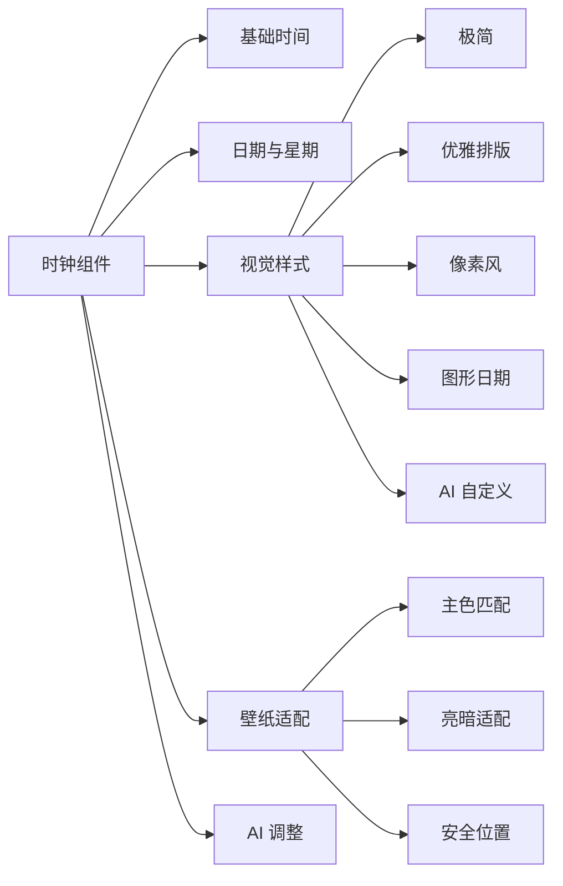
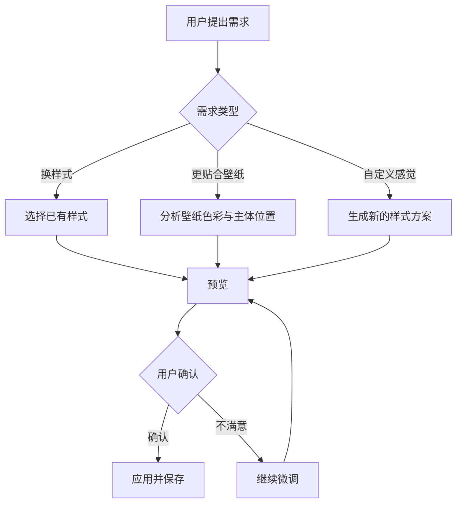
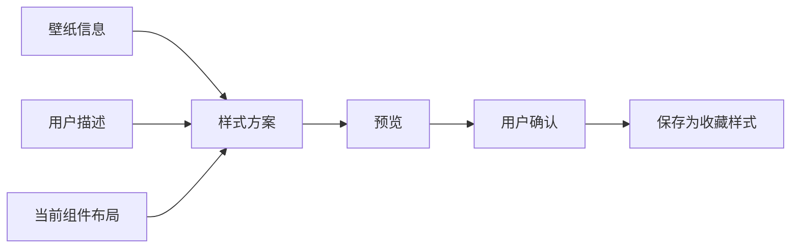

# 时钟组件设计

> 这是一份给产品设计、开发和 Agent 协作使用的设计文档。它说明“时钟组件应该给用户什么感觉”，不展开底层实现细节。

## 一句话定位

时钟组件是桌面的视觉锚点。它负责把时间、日期和壁纸氛围融合在一起，让用户一眼看到时间，同时不破坏桌面的美感。

## 设计目标

| 目标 | 用户感受 | 设计要求 |
| --- | --- | --- |
| 清晰 | 一眼看清时间 | 数字层级明确，避免花哨到影响阅读 |
| 融合 | 像壁纸的一部分 | 颜色、透明度、字体和位置要贴合壁纸 |
| 可变化 | 不同壁纸有不同气质 | 支持多种样式，并允许 AI 生成新样式 |
| 不遮挡 | 不盖住壁纸主体 | 自动避开人物、Logo、中心图案和其他组件 |
| 可控 | 用户可以一句话调整 | Agent 能切换样式、调整颜色、生成适配方案 |

## 体验结构图

## 当前样式整理

当前项目里已有多种时钟形态，产品上统一归为“时钟组件”的不同样式。

| 样式 | 适合场景 | 视觉重点 | 后续方向 |
| --- | --- | --- | --- |
| 极简时钟 | 干净、留白多的壁纸 | 大号时间 | 增加秒数、12/24 小时制 |
| 优雅日期时钟 | 人像、摄影、浅色壁纸 | 星期、时间、日期组合 | 增加更精致的排版比例 |
| 像素时钟 | 复古、游戏、像素风壁纸 | 像素字体和块状节奏 | 增加更多像素主题 |
| 图形日期 | 海报感、强构图壁纸 | 大日期数字和辅助信息 | 接入统一天气摘要 |
| AI 生成样式 | 用户想让样式跟壁纸更搭 | 由壁纸和用户描述决定 | 保存为用户样式收藏 |

## 用户调整流程

## 壁纸适配原则

| 壁纸情况 | 时钟设计建议 |
| --- | --- |
| 深色壁纸 | 使用浅色文字、轻微发光或柔和阴影 |
| 亮色壁纸 | 使用深色文字、描边或低饱和颜色 |
| 人物在中间 | 时钟优先放到角落、边缘或留白区 |
| 动态壁纸运动强 | 减少复杂动画，避免阅读干扰 |
| 壁纸颜色很丰富 | 时钟颜色应克制，减少多色叠加 |
| 极简壁纸 | 可以使用更强的字体层级和排版设计 |

## AI 可控能力

| 用户可以这样说 | Agent 应该做什么 | 是否需要确认 |
| --- | --- | --- |
| “把时钟放右上角” | 调整位置，避开其他组件 | 需要 |
| “换成像素风” | 切换到像素样式 | 不需要 |
| “根据这张壁纸重新设计时钟” | 生成壁纸适配样式，并先给预览 | 保存前需要 |
| “透明一点” | 调整透明度 | 不需要 |
| “不要挡住人物” | 重新寻找安全位置 | 需要 |
| “恢复刚才的样式” | 回到上一次样式 | 不需要 |

## 样式生成规则

AI 生成新样式时，不应该直接改代码，而是生成一套可保存、可预览、可回滚的样式方案。

样式方案应包含这些设计要素：

| 要素 | 说明 |
| --- | --- |
| 字体气质 | 极简、优雅、像素、科技、海报感等 |
| 排版关系 | 时间、日期、星期的主次和位置 |
| 色彩方案 | 主色、辅助色、阴影、描边、透明度 |
| 空间约束 | 不遮挡壁纸主体，不压住其他组件 |
| 使用理由 | 说明为什么适合当前壁纸 |

## 状态设计

| 状态 | 用户看到什么 | 设计要求 |
| --- | --- | --- |
| 正常 | 时间稳定显示 | 不闪烁，不跳动，不影响阅读 |
| 编辑中 | 出现选中和移动反馈 | 边界清楚，操作轻量 |
| 预览中 | 临时展示新样式 | 明确还没有保存 |
| 适配失败 | 保持旧样式 | 不自动套用不确定方案 |
| 恢复中 | 回到上一次样式 | 用户能理解发生了什么 |

## 后续完善方向

| 优先级 | 方向 | 价值 |
| --- | --- | --- |
| 高 | 统一时钟组件入口 | 用户不需要理解多个底层类型 |
| 高 | 增加样式预览和回滚 | 让 AI 调整更安心 |
| 高 | 壁纸主色和安全区域识别 | 样式更贴合壁纸 |
| 中 | 用户样式收藏 | 保存喜欢的时钟方案 |
| 中 | 多时区和日期格式 | 适配更多使用场景 |
| 低 | 节日、农历、天气摘要 | 增强信息层次 |
