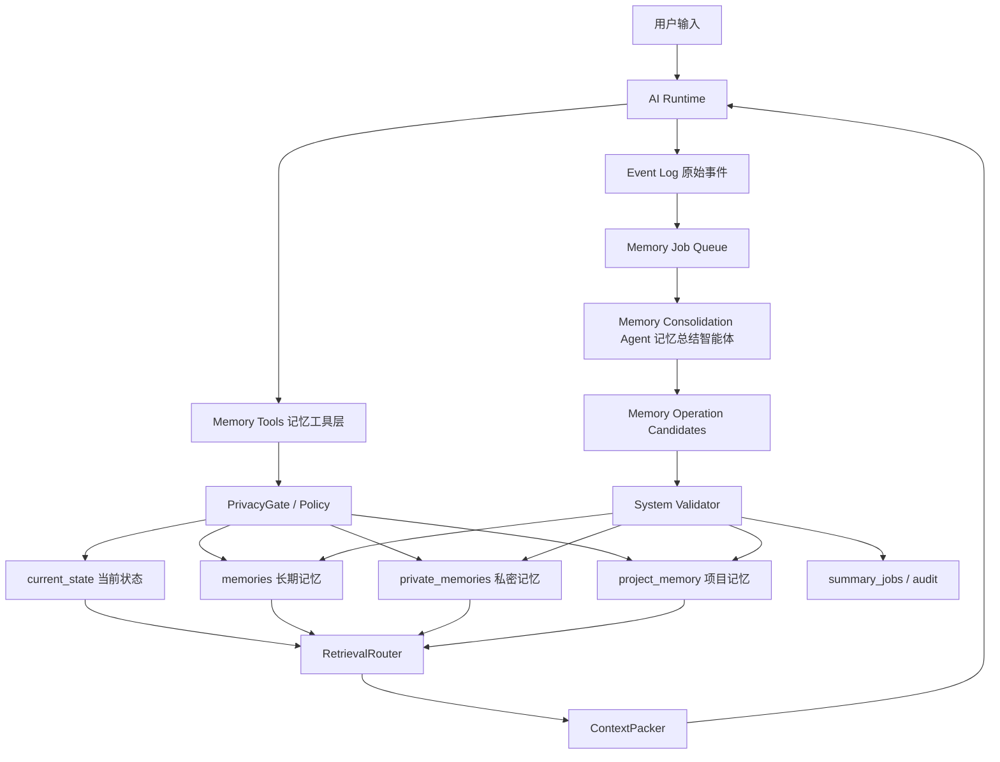
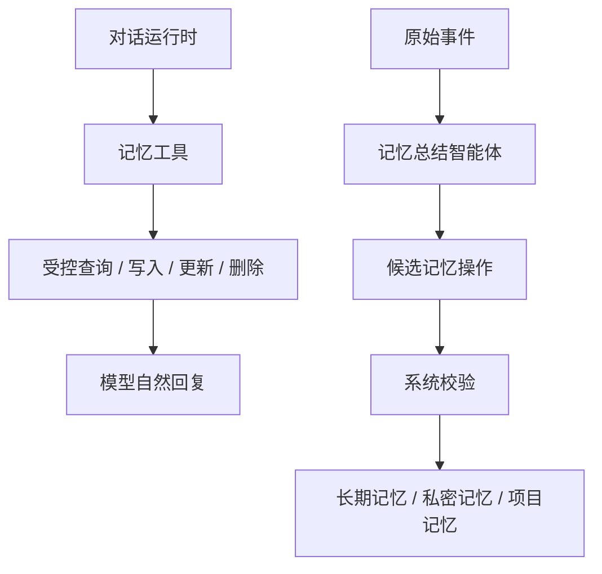

# 灵月记忆系统设计说明

> 资料角色（2026-09-05 核对）：本文件是应用记忆系统的详细设计，包含目标态，不是开发 Agent 规则或完成度证明。产品方向与当前缺口见 [项目状态](../TempFile/文档资料/project-status.md)；相关资料分工见 [知识索引](../TempFile/文档资料/knowledge-index.md)。

> 最后更新：2026-05-15
> 读者：产品设计、前端交互、后端架构和后续接手开发者
> 本文只描述记忆系统本身的设计，不记录旧文档整合过程，也不作为当前实现进度总结。

## 0. 一句话定位

灵月的记忆系统是一个本地优先的长期上下文基础设施。它负责把对话、工具调用、工作区任务和用户显式指令转化为可控、可检索、可更新、可删除的记忆，并以工具形式供语言模型调用。

记忆系统的核心不是“把历史聊天全部塞给模型”，而是建立一条受控闭环：

```text
原始事件 -> 记忆总结智能体 -> 结构化记忆 -> 检索路由 -> 上下文注入 / 记忆工具调用 -> 模型回复
```

两个设计点最重要：

| 核心点 | 说明 |
| --- | --- |
| 记忆总结智能体 | 后台智能体定期阅读原始事件，提取、合并、更新长期记忆，但最终写入必须经过系统规则校验 |
| 记忆工具化 | 记忆像天气、搜索、文件工具一样暴露给语言模型，模型只能通过工具查询、写入、修改或删除记忆，不能直接操作数据库 |

---

## 1. 设计目标

### 1.1 用户目标

用户应该感觉灵月长期相处后更懂自己，但不会让记忆失控。

| 用户期待 | 系统设计 |
| --- | --- |
| 灵月记得我的稳定偏好 | 长期记忆层保存偏好、关系、称呼和互动方式 |
| 灵月知道当前状态 | 当前状态层保存任务、日程、闹钟、设备和工具状态 |
| 灵月能持续跟进工作 | 工作区记忆绑定项目和 AgentRun |
| 灵月不会乱提私密内容 | 私密记忆独立存储、独立召回、默认隔离 |
| 我可以纠正或删除记忆 | 记忆管理和工具化修改/删除能力 |

### 1.2 系统目标

- 本地存储：原始事件、长期记忆、私密记忆和索引默认保存在本机。
- 低延迟：普通聊天不能因为记忆检索和总结变慢。
- 场景隔离：日常、工作、工具、私密模式不能互相污染。
- 可控写入：模型只能提出记忆操作，系统负责校验和落库。
- 可解释召回：系统知道本轮召回了哪些记忆、为什么召回、是否被过滤。
- 可扩展工具：日程、闹钟、桌面组件、搜索、工作区 Agent 都能把状态和事件接入记忆系统。

### 1.3 非目标

- 不把所有聊天都变成长期记忆。
- 不用向量检索替代结构化状态和场景规则。
- 不让语言模型直接读写数据库。
- 不在每轮聊天同步执行深度总结。
- 不在每轮聊天都对长期记忆库做向量匹配。
- 不把私密记忆交给普通聊天模型自由判断。

---

## 2. 总体架构

### 2.1 架构图



### 2.2 两条语言模型调用路径

记忆系统会使用语言模型，但必须区分两种调用路径。

| 调用路径 | 发起者 | 目的 | 能否直接写库 |
| --- | --- | --- | --- |
| 对话模型调用记忆工具 | 普通聊天模型或 Agent 模型 | 查询、写入、更新、删除用户明确相关的记忆 | 不能直接写库，只能调用工具 |
| 记忆总结智能体调用模型 | 后台总结任务 | 从原始事件中提取候选记忆 | 不能直接写库，只能产出候选操作 |

也就是说，模型不是记忆系统的主人。模型只参与理解、提取和表达；存储、隔离、权限、合并和删除由系统控制。

### 2.3 核心组件

| 组件 | 职责 |
| --- | --- |
| Event Log | 保存原始对话、工具、AgentRun 和系统事件 |
| Current State Store | 保存准确、结构化、可过期的当前事实 |
| User Profile Summary | 保存每轮可直接注入的稳定用户画像摘要，不通过向量检索生成 |
| Memory Store | 保存长期稳定记忆 |
| Private Memory Store | 保存私密场景专用记忆 |
| Project Memory | 保存项目级目标、约束、决策、进展和产物摘要 |
| Memory Tools | 给语言模型调用的记忆查询和写入工具 |
| Memory Consolidation Agent | 后台总结智能体，负责从原始事件提取候选记忆 |
| RetrievalRouter | 判断当前场景查哪些记忆、用什么检索方式 |
| PrivacyGate | 过滤不该进入当前场景的记忆 |
| ContextPacker | 把筛选后的记忆打包成模型上下文 |

---

## 3. 数据层设计

### 3.1 Event Log 原始事件层

Event Log 保存“发生过什么”。它是记忆总结、调试、审计和回溯的原始资料，不等于长期记忆。

事件来源：

- 用户消息。
- AI 回复。
- 工具调用。
- 工具结果。
- 工作区 AgentRun 事件。
- 用户确认、拒绝、纠错、删除记忆。
- 外部工具或桌面组件事件。

事件字段：

```text
id
conversation_id
project_id
event_type
mode
content_json
sensitivity
created_at
summary_status
```

规则：

- 所有对话消息和工具结果必须写入 Event Log。
- 原始事件默认不直接注入模型上下文。
- 总结智能体只处理 `summary_status = pending` 的事件。
- 用户删除记忆后，对应来源事件不能再次自动生成同一条记忆。

### 3.2 Current State 当前状态层

Current State 保存“现在是什么”。它不靠模型猜，也不靠向量匹配。

适合存储：

- 当前任务。
- 当前工具执行状态。
- 当前天气和城市。
- 闹钟、日程、待办。
- 桌面组件状态。
- 设备状态。
- 当前工作区和活动项目。

字段：

```text
key
domain
value_json
expires_at
updated_at
source_event_id
```

规则：

- `key` 唯一，重复写入覆盖。
- 有时效的信息必须写 `expires_at`。
- 读取时跳过过期状态。
- 当前事实优先精确查询，不走向量召回。

### 3.2.1 User Profile Summary 常驻画像摘要

常驻画像摘要保存“每轮对话都值得让模型知道的稳定信息”。它不是一次向量检索结果，而是从长期记忆、用户设置和后台总结中整理出来的一小份高密度摘要。

适合放入常驻画像：

| 信息 | 示例 | 原因 |
| --- | --- | --- |
| 稳定身份和称呼 | 用户希望被怎样称呼 | 影响每轮语气，不需要每次检索 |
| 常用城市和地点偏好 | 用户常用城市是北京 | 天气、出行、生活建议常用 |
| 回复风格偏好 | 用户不喜欢机械化工具提示 | 影响所有回复和过程反馈 |
| 工具和验证习惯 | 用户重视 typecheck、build、实际启动验证 | 影响工作区 Agent 的行为 |
| 当前主要项目 | LingyueDesk | 让工作对话快速进入正确语境 |

不适合放入常驻画像：

- 一次性天气、新闻、搜索结果。
- 临时任务过程。
- 低置信或未确认推断。
- 私密场景专用内容。
- 太长的历史叙述。

读取规则：

```text
每轮对话
  -> 读取短小的 User Profile Summary
  -> 读取未过期的 Current State 精确事实
  -> 不默认对 Long-term Memory 做向量匹配
```

更新规则：

| 触发 | 行为 |
| --- | --- |
| 用户明确说“记住” | 写入长期记忆，并同步更新画像摘要中的相关字段 |
| 用户纠正偏好或地点 | 更新长期记忆，重建对应画像项 |
| 后台总结发现稳定重复模式 | 生成候选，系统校验后合入长期记忆和画像摘要 |
| 工具结果是时间敏感事实 | 写入 Current State，不写入画像摘要 |

这样可以让模型每轮都知道“用户在北京”“不喜欢机械提示”这类稳定事实，同时避免每句话都去长期记忆库做语义匹配。

### 3.3 Long-term Memory 长期记忆层

Long-term Memory 保存“未来仍然有用的信息”。

适合沉淀：

- 用户稳定偏好。
- 称呼、互动风格、回复长度偏好。
- 重要关系和纪念日。
- 高强度情绪事件和安慰偏好。
- 工作项目目标、约束、技术决策。
- 重复出现的工具使用习惯。
- 用户明确说“记住这个”的内容。

不应沉淀：

- 一次性闲聊。
- 临时操作。
- 大量工具中间过程。
- 过期天气、一次性新闻、临时股票状态。
- 未经确认的敏感推断。

字段：

```text
id
key
scope
memory_type
project_id
content
importance
confidence
sensitivity
created_at
updated_at
last_used_at
status
source_event_ids
embedding_id
```

scope 建议：

| scope | 含义 | 默认可用场景 |
| --- | --- | --- |
| user | 用户个人事实 | daily、emotion、部分 work |
| general | 通用偏好 | daily、tool、work |
| companion | 伴侣互动偏好 | daily、emotion |
| work | 工作项目记忆 | work，优先绑定 project_id |
| tool | 工具偏好和自动化习惯 | tool、daily |

### 3.4 Private Memory 私密记忆层

Private Memory 单独存放、单独召回，默认不进入 daily、work、tool。

保存内容：

- 私密模式语气偏好。
- 称呼和边界。
- 暗号和触发规则。
- 私密互动氛围偏好。
- 用户明确允许记录的私密内容。

规则：

- 必须经过 PrivacyGate 才能读取。
- 普通聊天、工作模式、工具模式不能主动召回私密记忆。
- 私密记忆应使用独立数据库或字段级加密。
- 用户必须能单独查看、删除、清空私密记忆。

### 3.5 Project Memory 项目记忆层

Project Memory 保存一个工作项目或本地文件夹的长期上下文。

适合沉淀：

- 项目目标。
- 技术选型。
- 目录结构约定。
- 用户要求的开发习惯。
- 已完成任务。
- 未解决问题。
- 常用验证命令。
- 重要文件和产物。

规则：

- 项目记忆必须绑定 `project_id`。
- 不同项目默认不互相召回。
- 用户明确要求参考其他项目时，才允许跨项目检索。
- 导出摘要时默认隐藏本机绝对路径。

---

## 4. 时间与时序设计

记忆系统必须把时间当成一等上下文。很多记忆问题不是“有没有这条记忆”，而是“这条记忆发生在什么时候、现在是否仍然有效、用户说的上次/昨天/最近指哪一段时间”。

如果模型不知道当前时间，记忆召回会在这些场景里失真：

- “我昨天说的那个事是什么？”
- “上次做这个项目时怎么决定的？”
- “最近我是不是经常熬夜？”
- “这个偏好现在还适用吗？”
- “提醒我下周要做什么。”

### 4.1 当前时间必须进入模型上下文

所有涉及记忆、状态、日程、工具和工作区任务的模型调用，都必须由系统注入当前时间。当前时间不能让模型自己猜。

推荐上下文格式：

```text
【当前时间】
- 本地时间：2026-05-09 14:35:20
- 日期：2026-05-09
- 星期：周六
- 时区：Asia/Shanghai
- 语言环境：zh-CN
```

规则：

- 当前时间由系统生成，不能由模型生成。
- 相对时间解析必须基于系统注入的当前时间。
- 总结智能体、RetrievalRouter、ContextPacker 和记忆工具都要共享同一个时间基准。
- 如果用户指定其他时区或地点，工具层负责转换，不让模型自由推断。

### 4.2 原始事件必须保留发生时间

Event Log 是时序基础，每条事件都必须保留 `created_at`。工具调用和 AgentRun 还应记录开始时间、结束时间和耗时。

事件时序用于：

- 还原一轮对话的真实顺序。
- 判断“上次”“刚才”“最近”对应的事件范围。
- 支持后台总结按时间窗口分批处理。
- 支持用户回看某天、某周、某个项目阶段发生了什么。
- 支持删除记忆后阻止旧事件重新生成同一条记忆。

规则：

- `created_at` 使用系统时间写入。
- 事件排序优先按 `created_at`，同毫秒事件再按递增 id 排序。
- 工具结果必须能和 tool_call 对齐，避免模型把后发生的结果当成先验。
- AgentRun、Checkpoint、FileChange、Artifact 都必须保留时间字段，供工作记忆总结使用。

### 4.3 记忆本身需要时间属性

长期记忆不只是内容，还要知道它什么时候产生、什么时候更新、什么时候被使用，以及是否已经过期。

记忆时间字段：

```text
created_at
updated_at
last_used_at
valid_from
valid_until
source_event_times
```

字段含义：

| 字段 | 含义 |
| --- | --- |
| `created_at` | 这条记忆首次进入系统的时间 |
| `updated_at` | 这条记忆最后被修改或合并的时间 |
| `last_used_at` | 这条记忆最后一次被召回使用的时间 |
| `valid_from` | 记忆开始有效的时间，可选 |
| `valid_until` | 记忆失效时间，可选 |
| `source_event_times` | 来源事件发生时间，内部审计使用 |

设计要求：

- 偏好类记忆通常长期有效，但仍要保留更新时间。
- 状态类事实必须优先进入 `current_state`，并设置过期时间。
- 项目决策类记忆应保留项目阶段或 AgentRun 时间。
- 过期记忆不应直接注入上下文，可以作为历史信息在用户明确追问时召回。

### 4.4 相对时间解析

用户经常用相对时间表达记忆请求。系统需要先解析时间范围，再检索。

| 用户表达 | 系统应解析为 |
| --- | --- |
| 刚才 | 当前会话最近几分钟或最近若干事件 |
| 今天 | 当前本地日期 00:00 到现在 |
| 昨天 | 当前本地日期前一天 00:00 到 23:59 |
| 上周 | 按本地周起止规则解析 |
| 最近 | 默认最近 7 到 30 天，视场景和问题决定 |
| 上次 | 当前主题、项目或工具域下最近一次相关事件 |
| 之前 | 当前主题下较宽泛历史范围，需要召回候选 |

规则：

- 相对时间解析应发生在 RetrievalRouter 或记忆工具层。
- 解析结果作为 `timeRange` 传给检索，不只把原句丢给向量搜索。
- 如果时间范围不明确，工具返回候选或让模型追问。
- 工作区任务的“上次”优先限定当前 projectId 和相似 intent。

### 4.5 时间影响召回排序

记忆召回排序不能只看语义相似度。

排序建议综合：

- scene 匹配度。
- projectId 匹配度。
- 时间范围匹配度。
- importance。
- confidence。
- recency。
- last_used_at。
- 是否仍在 valid_until 之前。

常见策略：

- 用户问“最近”时，提高 recency 权重。
- 用户问“以前”时，扩大时间范围但降低低置信记忆权重。
- 用户问项目决策时，优先当前项目最近阶段的 work 记忆。
- 用户问稳定偏好时，优先高置信、最近更新的偏好。

### 4.6 总结智能体的时间窗口

记忆总结智能体必须按时间窗口工作，而不是每次扫描全部历史。

推荐流程：

```text
读取 pending events
  -> 按 conversation / project / mode 分组
  -> 按时间窗口切片
  -> 注入当前时间和窗口范围
  -> 提取候选记忆
  -> 标记窗口处理结果
```

总结智能体 prompt 必须包含：

- 当前时间。
- 本次处理的事件时间范围。
- 每条事件的发生时间。
- 已有相关记忆的更新时间。
- 判断记忆是否仍然有效的规则。

这样才能避免把过期状态写成长期记忆，也能判断“用户最近反复提到”是否真的成立。

---

## 5. 记忆工具化设计

记忆系统必须像天气、新闻、网页搜索、文件读写一样，作为工具提供给语言模型。语言模型不能直接查询或写入数据库，只能通过工具层表达意图。

### 5.1 工具层职责

Memory Tools 负责：

- 暴露可调用的 JSON schema。
- 校验输入参数。
- 注入当前 conversation、scene、project、persona 策略。
- 调用 PrivacyGate 判断是否允许查询或写入。
- 执行检索、写入、更新、删除。
- 写入 tool_call 和 tool_result 事件。
- 返回适合模型理解的摘要结果。

### 5.2 记忆工具列表

| 工具 | 用途 | 写入行为 |
| --- | --- | --- |
| `memory_recall` | 根据用户问题召回相关记忆候选 | 写 tool_call / tool_result |
| `memory_store` | 用户明确要求记住时写入记忆 | 写 memories，并写 tool_result |
| `memory_update` | 用户纠正旧记忆时更新 | 更新 memory，保留审计事件 |
| `memory_delete` | 用户要求忘记某事时删除或归档 | 软删除 memory，并写删除事件 |
| `memory_list` | 记忆管理页或模型受控查看 | 返回筛选后的记忆列表 |
| `memory_feedback` | 用户标记记忆错误、有用或过期 | 调整 confidence/status |
| `memory_commit_candidate` | 用户确认候选后提交 | 把候选操作落库 |

### 5.3 memory_recall

`memory_recall` 用于模型主动查记忆，尤其是用户问“你还记得吗”“我之前说过什么”“上次那个项目怎么定的”。

输入：

```json
{
  "query": "用户在问什么",
  "scene": "daily|emotion|work|tool|private",
  "projectId": "optional",
  "scopes": ["user", "companion"],
  "limit": 5
}
```

输出：

```json
{
  "found": true,
  "memories": [
    {
      "id": "mem_...",
      "key": "reply_style",
      "content": "用户更喜欢简短直接的回复。",
      "scope": "companion",
      "confidence": 8
    }
  ],
  "filtered": ["private_scope_blocked"],
  "summary": "找到 1 条相关记忆。"
}
```

规则：

- 工具必须根据当前 scene 自动限制 scope。
- 模型传入的 scopes 只是请求，最终允许范围由系统决定。
- private 记忆只有 private 场景可读。
- work 记忆优先限定 projectId。
- 没找到时返回 `found=false`，模型不能编造。

### 5.4 memory_store

`memory_store` 用于用户明确要求保存信息。

输入：

```json
{
  "key": "city_preference",
  "content": "用户常用城市是上海。",
  "scope": "user",
  "importance": "medium",
  "projectId": null,
  "reason": "用户明确要求记住"
}
```

规则：

- 只有用户明确要求，或系统策略允许的轻量偏好，才可立即写入。
- 私密内容必须确认当前是 private 场景。
- 工作内容应绑定 projectId。
- 如果与旧记忆冲突，工具返回候选冲突，让模型或 UI 请求用户确认。

### 5.5 memory_update 和 memory_delete

更新和删除必须比新增更谨慎。

规则：

- `memory_update` 需要 memoryId，或先通过 recall 找到候选。
- 如果候选不唯一，必须让用户选择。
- `memory_delete` 默认软删除，不直接物理删除。
- 用户要求“彻底忘记”时，需要清理长期记忆、私密记忆、候选队列和可再总结标记。
- 删除后不能由旧 events 自动重新生成同一条记忆。

### 5.6 工具调用和普通工具的关系

记忆工具和其他工具遵守同一套工具事件规则：

```text
模型提出工具调用
  -> Tool Registry 校验工具名和 schema
  -> Memory Tool 执行权限和场景检查
  -> 写入 tool_call
  -> 执行查询或写入
  -> 写入 tool_result
  -> 模型基于结果自然回复
```

这能保证记忆行为可审计、可展示、可回放，而不是藏在模型回复里。

---

## 6. 记忆总结智能体

记忆总结智能体是后台 Agent，不直接参与普通聊天回复。它负责把原始事件转化为候选记忆操作。

### 6.1 总结智能体输入

- 一段时间内的 pending events。
- 当前会话 mode 和 scene。
- projectId / workspace 信息。
- 已有相关记忆。
- 用户记忆策略和隐私策略。
- 上一次总结 job 的状态。

### 6.2 总结智能体输出

总结智能体不直接写数据库，只输出候选操作：

```json
[
  {
    "operation": "ADD",
    "key": "reply_style",
    "scope": "companion",
    "content": "用户更喜欢简短直接的回复。",
    "importance": "medium",
    "confidence": 8,
    "sensitivity": "normal",
    "sourceEventIds": ["evt_..."],
    "reason": "用户多次要求回复简短"
  }
]
```

支持的操作：

| 操作 | 含义 |
| --- | --- |
| ADD | 新增记忆 |
| UPDATE | 更新已有记忆 |
| MERGE | 合并多条相近记忆 |
| NOOP | 不写入 |
| ARCHIVE | 将旧记忆标记为过期 |
| DELETE | 用户明确要求删除时生成删除候选 |

### 6.3 总结流程

```text
Memory Job Scheduler
  -> 读取 pending events
  -> 按 conversation / mode / project 分组
  -> 选择对应 extractor
  -> 调用记忆总结智能体
  -> 输出候选 MemoryOperation
  -> System Validator 校验
  -> 冲突检测和去重
  -> 必要时进入用户确认队列
  -> commit 到 MemoryStore / PrivateMemoryStore / ProjectMemory
  -> 更新 events.summary_status 和 summary_jobs
```

### 6.4 Extractor 类型

| Extractor | 输入 | 输出重点 |
| --- | --- | --- |
| dailyExtractor | 日常对话 | 偏好、生活事件、关系信息 |
| emotionExtractor | 情绪支持对话 | 安慰偏好、高强度情绪事件 |
| workExtractor | 工作会话和 AgentRun | 项目目标、决策、约束、进展、未解决问题 |
| privateExtractor | 私密对话 | 私密偏好、边界、暗号，只写 private |
| toolExtractor | 工具调用和结果 | 稳定工具偏好、自动化模式 |

### 6.5 总结触发

| 触发 | 行为 |
| --- | --- |
| 定时触发 | 每天固定执行 2 次左右，不打断聊天 |
| 用户明确记住 | 直接走 memory_store，不等后台总结 |
| 会话结束 | 标记事件进入总结队列 |
| AgentRun 完成 | workExtractor 提取项目进展和产物摘要 |
| 私密模式结束 | privateExtractor 进入独立私密队列 |

### 6.6 系统校验

总结智能体输出后，系统必须过滤：

- 空内容。
- 低价值寒暄。
- 明显幻觉。
- 与 scene 不符的 private 内容。
- 没有 projectId 的项目细节。
- 过期状态事实。
- 未经确认的敏感推断。
- 与用户删除记录冲突的旧记忆。

---

## 7. 召回与上下文设计

### 7.1 召回不是全库搜索

普通对话不能理解成“每轮都去长期记忆库做向量匹配”。更合适的策略是：每轮读取短小的常驻画像摘要和当前状态；只有用户问题确实需要历史细节时，才触发长期记忆召回。

```text
用户输入
  -> 注入 User Profile Summary
  -> 精确读取未过期 Current State
  -> 判断是否需要长期记忆召回
  -> 需要时选择 scope / project / 检索方式
  -> PrivacyGate 过滤
  -> 排序、去重、控制长度
  -> ContextPacker 注入上下文
```

| 信息来源 | 是否每轮读取 | 是否向量匹配 | 说明 |
| --- | --- | --- | --- |
| User Profile Summary | 是 | 否 | 短小稳定画像，直接读取 |
| Current State | 是，按需精确查询 | 否 | 天气、任务、设备等有 TTL 的当前事实 |
| Long-term Memory | 否，触发式召回 | 只有需要模糊回忆时才用 | 偏好、关系、项目决策等长期记忆 |
| Private Memory | 否 | 仅 private 场景受控使用 | 默认不进入普通、工作、工具场景 |

触发长期记忆召回的典型情况：

- 用户明确说“你还记得吗”“之前说过”“上次那个”。
- 当前问题依赖历史细节，而常驻画像摘要不足以回答。
- 当前是情绪、陪伴或长期关系类对话，需要历史连续性。
- 工作区问题需要项目长期决策或旧 AgentRun 摘要。
- 模型主动调用 `memory_recall`，并由工具层按 scene、scope、project 和隐私规则过滤。

不触发长期记忆召回的情况：

- 当前问题只需要常驻画像即可补全，例如默认城市、称呼、回复风格。
- 当前问题只需要 Current State，例如刚查过且未过期的天气。
- 用户只是普通闲聊，且没有历史依赖。
- 低价值、低相关、可能引发误联想的旧记忆。

### 7.2 检索方式选择

| 信息类型 | 优先方式 |
| --- | --- |
| 当前时间、天气、闹钟、日程、设备状态 | current_state 精确查询 / TTL |
| 明确人名、项目名、地点 | 关键词 / FTS |
| 用户稳定偏好 | scope + importance + recency |
| 工作项目决策 | projectId + work scope + 关键词 |
| 模糊语义回忆 | 向量 + 关键词混合 |
| 私密偏好 | private scene + private index |
| 工具状态 | current_state + 最近 events |

### 7.3 被动注入和主动工具调用

记忆进入模型有两种方式：

| 方式 | 触发 | 例子 |
| --- | --- | --- |
| 常驻画像注入 | 每轮固定注入短小稳定摘要 | 城市、称呼、回复风格、常用项目 |
| 被动上下文注入 | 系统判断少量记忆对当前回复有帮助 | 用户问“今天想吃什么”，注入饮食偏好 |
| 主动工具调用 | 模型判断需要查记忆，调用 `memory_recall` | 用户问“你还记得我上次说的项目方案吗” |

常驻画像要稳定、短小、低噪声；被动注入要短；主动工具调用要可见、可审计。

### 7.4 ContextPacker 格式

推荐注入格式：

```text
【关于用户的已知记忆】
- [reply_style] 用户更喜欢简短直接的回复。
- [diet] 用户不太能吃辣。

【当前状态信息】
- [task:current] 用户正在整理记忆系统设计。

【当前项目记忆】
- [project:lingyue] 项目使用 Electron + React + TypeScript。
```

禁止：

- 注入完整历史聊天。
- 注入低相关记忆。
- 注入 private 到普通场景。
- 注入未过 PrivacyGate 的敏感内容。

---

## 8. 场景隔离和隐私

### 8.1 场景定义

| scene | 默认使用 | 默认屏蔽 |
| --- | --- | --- |
| daily | general、companion、user | private、过重 work |
| emotion | companion、user、近期高强度情绪 | private、tool logs、无关 work |
| work | work、relevant general、project memory | private、无关 daily |
| tool | current_state、tool、必要 general | private、emotion |
| private | private | work、tool、普通工作记忆 |

### 8.2 PrivacyGate 硬规则

- private 记忆不能进入 daily、work、tool。
- work 场景不能主动召回私密调情记忆。
- tool 场景优先查 current_state，不使用情感记忆做判断。
- 私密记忆读取必须经过 private mode、暗号、手动切换或明确的人设策略。
- 用户删除私密记忆后，不得通过原始事件再次自动提取回来。

### 8.3 用户控制

用户必须能够：

- 查看重要记忆。
- 修改错误记忆。
- 删除记忆。
- 清空私密记忆。
- 关闭某类记忆。
- 禁用后台总结。
- 导出记忆摘要。
- 查看最近一次总结任务状态。

---

## 9. 前端体验设计

### 9.1 对话区反馈

| 场景 | UI 表现 |
| --- | --- |
| 用户明确说“记住这个” | 简短工具状态行：“已记住” |
| 模型主动查记忆 | 工具状态行：“正在回忆” / “找到相关记忆” |
| 没找到记忆 | 最终回复自然说明，不编造 |
| 多条候选或冲突 | 展示候选卡，让用户选择 |
| 删除或修改记忆 | 显示确认结果 |
| 私密记忆 | 只在私密入口或私密模式中展示 |

### 9.2 记忆管理页

建议分组：

| 分组 | 内容 | 操作 |
| --- | --- | --- |
| 关于我 | 用户事实、偏好、生活习惯 | 编辑、删除、设为过期 |
| 互动方式 | 称呼、语气、回复风格、边界 | 编辑、删除 |
| 工作项目 | 项目目标、约束、决策、未解决问题 | 按项目筛选、打开关联任务 |
| 工具习惯 | 常用城市、新闻偏好、自动化倾向 | 编辑、删除 |
| 私密记忆 | 私密偏好和边界 | 独立入口、二次确认 |

每条记忆默认显示内容、分类、重要度、更新时间和来源类型。高级展开显示置信度、来源事件、最近使用时间和状态。

### 9.3 候选确认

这些情况需要用户确认：

- 新记忆和旧记忆冲突。
- 更新或删除候选不唯一。
- 记忆内容敏感。
- 总结智能体不确定是否值得长期保存。
- 用户要求“忘记”但涉及多条相似记忆。

---

## 10. 工具和外部能力接入

每个工具模块接入记忆系统时，只需要遵守三条原则：

1. 工具调用和结果写入 Event Log。
2. 当前有效状态写入 Current State。
3. 只有稳定偏好、重复模式、异常事件或用户明确要求，才进入长期记忆。

示例：

| 工具 | Event Log | Current State | Long-term Memory |
| --- | --- | --- | --- |
| 天气 | 查询城市和结果 | 当前城市天气，设置 TTL | 常用城市、温度偏好 |
| 闹钟 | 创建/删除/修改事件 | 当前闹钟列表 | 重复作息偏好 |
| 新闻 | 查询来源和结果 | 当前热点缓存 | 常看新闻源 |
| 工作区文件 | 读写文件、生成产物 | 当前 AgentRun 状态 | 项目决策和成果摘要 |
| 桌面组件 | 状态变化 | 当前组件配置 | 用户长期布局偏好 |

---

## 11. Prompt 工程

### 11.1 Prompt 分层

| Prompt 层 | 负责什么 |
| --- | --- |
| Persona Prompt | 灵月的人设、语气、边界 |
| Memory Context Prompt | 已召回的长期记忆和当前状态 |
| Tool Capability Prompt | 记忆工具和其他工具的使用方式 |
| Router Prompt | 判断聊天、工具、Agent、记忆动作 |
| Extractor Prompt | 总结智能体从 events 中提取候选记忆 |
| Agent Prompt | 工作区 Agent 使用项目记忆、计划和工具 |

### 11.2 Router Prompt 原则

Lite 路由需要能区分：

- 普通聊天。
- 主动回忆：调用 `memory_recall`。
- 明确记住：调用 `memory_store`。
- 纠正记忆：调用 `memory_update`。
- 删除记忆：调用 `memory_delete`。
- 复杂工作任务：进入 Workspace Agent。

路由输出必须是结构化 JSON，不输出解释性文本。

### 11.3 Extractor Prompt 原则

总结智能体 prompt 必须强调：

- 只提取长期有用的信息。
- 忽略普通寒暄、一次性操作和工具中间过程。
- 区分 scope 和 scene。
- work 记忆绑定 projectId。
- private 内容只进入 private。
- 输出候选操作，不宣称已经写入。

### 11.4 回复风格约束

模型使用记忆时：

- 要自然融入回复。
- 不要机械说“根据我的记忆”。
- 不要过度展示来源。
- 不要把很久前的事情强行提起。
- 情绪支持场景可以柔和使用伴侣记忆。
- 工作场景优先使用项目记忆，不插入无关生活内容。

---

## 12. 验收标准

### 12.1 功能验收

| 能力 | 验收 |
| --- | --- |
| 事件记录 | 用户消息、AI 回复、工具调用、工具结果都进入 Event Log |
| 工具化记忆 | 模型只能通过记忆工具查询、写入、更新和删除记忆 |
| 明确记住 | 用户说“记住这个”后可通过记忆工具查到 |
| 总结智能体 | 后台总结能输出候选操作，并经过系统校验后写入 |
| 场景隔离 | work 不召回 private，private 不混入 work |
| 当前状态 | 状态型工具写入 current_state 并按 TTL 过期 |
| 召回失败 | 没找到时不编造，能自然说明 |
| 删除记忆 | 删除后普通召回不再出现，也不会被旧事件自动重建 |

### 12.2 安全验收

| 能力 | 验收 |
| --- | --- |
| 私密隔离 | private_memories 不进入 daily/work/tool 上下文 |
| 系统校验 | 总结智能体输出必须经过 Validator 才能落库 |
| 工具审计 | 每次记忆工具调用都有 tool_call/tool_result |
| 用户控制 | 用户能查看、修改、删除和关闭记忆 |
| 敏感内容 | 敏感记忆不进入普通场景 |

### 12.3 体验验收

| 能力 | 验收 |
| --- | --- |
| 普通聊天 | 不因记忆检索明显变慢 |
| 记忆反馈 | 工具状态行简洁，不污染正文 |
| 冲突处理 | 询问用户确认，不静默覆盖 |
| 私密体验 | 私密记忆只在私密入口或私密场景出现 |
| 工作协作 | 项目记忆能帮助继续之前的工作任务 |

---

## 13. 禁止事项

- 不要把所有聊天都写入长期记忆。
- 不要把所有检索都做成向量检索。
- 不要让模型直接读写记忆数据库。
- 不要让总结智能体绕过系统校验直接落库。
- 不要在每轮聊天同步做深度总结。
- 不要在普通聊天中加载完整工作项目历史。
- 不要在 work 场景召回 private 记忆。
- 不要删除用户记忆后又从旧 events 自动恢复。
- 不要把记忆工具结果伪装成模型自己“想起来”的内容。

---

## 14. 总结

灵月记忆系统的价值不在于“存得多”，而在于“在正确场景想起正确的信息，并且允许用户控制它”。

最终系统由两条闭环组成：



对话模型通过工具使用记忆，后台总结智能体负责整理记忆，系统负责边界和落库。这个分工是记忆系统可靠、可控、可长期扩展的基础。